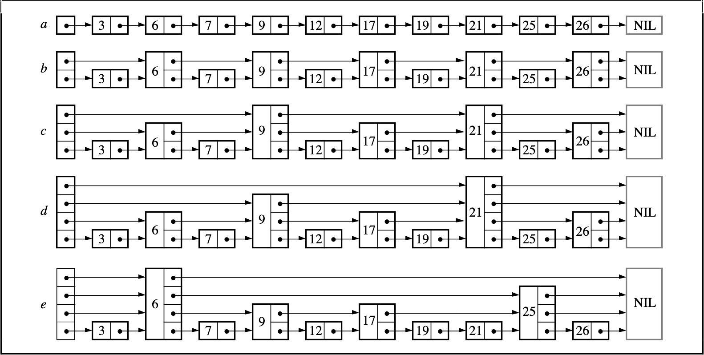

<!-- START doctoc generated TOC please keep comment here to allow auto update -->

<!-- DON'T EDIT THIS SECTION, INSTEAD RE-RUN doctoc TO UPDATE -->

**Table of Contents**  *generated with [DocToc](https://github.com/thlorenz/doctoc)*

- [🌲树](#%E6%A0%91)
  - [平衡二叉树](#%E5%B9%B3%E8%A1%A1%E4%BA%8C%E5%8F%89%E6%A0%91)
  - [红黑树](#%E7%BA%A2%E9%BB%91%E6%A0%91)
  - [红黑树和平衡二叉树](#%E7%BA%A2%E9%BB%91%E6%A0%91%E5%92%8C%E5%B9%B3%E8%A1%A1%E4%BA%8C%E5%8F%89%E6%A0%91)
  - [B树&B+树](#b%E6%A0%91b%E6%A0%91)
  - [跳表](#%E8%B7%B3%E8%A1%A8)

<!-- END doctoc generated TOC please keep comment here to allow auto update -->

<!--
 * @Author: xingzheng
 * @Date: 2021-07-18 23:41:41
 * @LastEditTime: 2021-07-18 23:43:11
 * @LastEditors: Please set LastEditors
 * @Description: In User Settings Edit
 * @FilePath: /Job/algorithm/tree.md
-->

# 🌲树

## 平衡二叉树

左右子树高相差1

## 红黑树

[红黑树原理讲解](https://www.jianshu.com/p/e136ec79235c)

性质1：每个节点要么是黑色，要么是红色。

性质2：根节点是黑色。

性质3：每个叶子节点（NIL）是黑色。

性质4：每个红色结点的两个子结点一定都是黑色。

**性质5：任意一结点到每个叶子结点的路径都包含数量相同的黑结点。**

## 红黑树和平衡二叉树

本质上其实差不多，AVL的查询性能更好一点，因为树高是平均的。红黑树的插入和删除性能更好一点，因为不需要严格要求树高。

## B树&B+树

B+ 树的优点在于：由于B+树在内部节点上不包含数据信息，因此在内存页中能够存放更多的key。  数据存放的更加紧密，具有更好的空间局部性。因此访问叶子节点上关联的数据也具有更好的缓存命中率。B+树的叶子结点都是相连的，因此对整棵树的便利只需要一次线性遍历叶子结点即可。而且由于数据顺序排列并且相连，所以便于区间查找和搜索。而B树则需要进行每一层的递归遍历。相邻的元素可能在内存中不相邻，所以缓存命中性没有B+树好。但是B树也有优点，其优点在于，由于B树的每一个节点都包含key和value，因此经常访问的元素可能离根节点更近，因此访问也更迅速。

## 跳表

[skip-list](https://15721.courses.cs.cmu.edu/spring2018/papers/08-oltpindexes1/pugh-skiplists-cacm1990.pdf)

