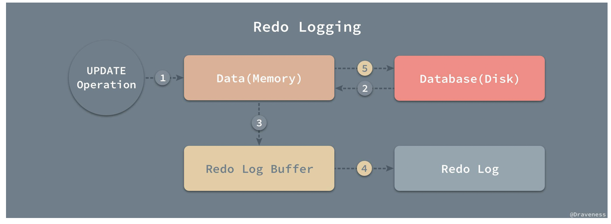

<!--
 * @Author: your name
 * @Date: 2021-08-27 11:07:20
 * @LastEditTime: 2021-08-27 11:08:13
 * @LastEditors: Please set LastEditors
 * @Description: In User Settings Edit
 * @FilePath: /Job/database/mysql.md
-->

## Mysql

#### MySQL一次sql查询的执行流程。

#### Mysql存储引擎

##### Innodb

##### MyISAM

- 不支持表锁和事务
- 支持全文索引

##### Memory

- 表的数据存放在内存中，因此速度非常快
- 默认使用hash索引而不是b+树
- 只支持表锁，性能比较差

#### mysql索引类型（深度赋智）

##### 聚集索引和非聚集索引（二级索引）

- 块按照主键顺序存放
- 块可能分散，mysql中存储的指向数据的索引

#### mysql Join

Mysql只支持Nested Loop Join，不支持其他数据库提供的Hash Join & sort- Merge Join

因此，在多表进行Join的过程中，对于被驱动表的Join的列建立索引可以有效的优化开销 

#### mysql 如何存储数据

#### mysql事务

#### ACID

##### 原子性

事务要么全部执行，要么全部不执行

实现：通过undo log来实现事务的原子性

##### 持久性

事务一旦提交，数据一定会被写入到数据库并持久的存储下来

通过redo log 来实现

##### 隔离性

事务和事务之间是相互隔离的，引入事务的隔离级别

**[mysql事务隔离级别和实现原理](https://zhuanlan.zhihu.com/p/117476959)**

###### **基本概念**

**脏读**

脏读指的是读到了其他事务未提交的数据，未提交意味着这些数据可能会回滚，也就是可能最终不会存到数据库中，也就是不存在的数据。读到了并一定最终存在的数据，这就是脏读。

**可重复读**

可重复读指的是在一个事务内，最开始读到的数据和事务结束前的任意时刻读到的同一批数据都是一致的。通常针对数据**更新（UPDATE）**操作。

**不可重复读**

对比可重复读，不可重复读指的是在同一事务内，不同的时刻读到的同一批数据可能是不一样的，可能会受到其他事务的影响，比如其他事务改了这批数据并提交了。通常针对数据**更新（UPDATE）**操作。

**幻读**

幻读是针对数据**插入（INSERT）**操作来说的。假设事务A对某些行的内容作了更改，但是还未提交，此时事务B插入了与事务A更改前的记录相同的记录行，并且在事务A提交之前先提交了，而这时，在事务A中查询，会发现好像刚刚的更改对于某些数据未起作用，但其实是事务B刚插入进来的，让用户感觉很魔幻，感觉出现了幻觉，这就叫幻读。

###### **事务隔离级别**

SQL 标准定义了四种隔离级别，MySQL 全都支持。这四种隔离级别分别是：

1. 读未提交（READ UNCOMMITTED）
2. 读提交 （READ COMMITTED）
3. 可重复读 （REPEATABLE READ）
4. 串行化 （SERIALIZABLE）

从上往下，隔离强度逐渐增强，性能逐渐变差。采用哪种隔离级别要根据系统需求权衡决定，其中，**可重复读**是 MySQL 的默认级别。

事务隔离其实就是为了解决上面提到的脏读、不可重复读、幻读这几个问题，下面展示了 4 种隔离级别对这三个问题的解决程度。

只有串行化的隔离级别解决了全部这 3 个问题，其他的 3 个隔离级别都有缺陷。

###### 隔离性的实现

隔离性的实现主要靠锁来实现

- 解决不可重复读，通过加行锁来解决
- 解决幻读，通过行锁和间隙锁来进行

##### 一致性

如果一个事务原子地在一个一致地数据库中独立运行，那么在它执行之后，数据库的状态一定是一致的。

#### 三大log

##### BingLog

- BingLog 在Mysql数据库上层产生，不仅仅针对于InnoDB
- BingLog是一种逻辑日志，存储的是sql语句
- Binglog是在commit之后一次生成的

##### RedoLog

- redolog是在InnoDB存储引擎层产生的
- 重做日志是物理格式日志，针对的是对每个页的更改
- 写入时间，在事务执行的过程中，默认redolog是周期性的持久化的，表现为对于多个事务来说，redolog不是按顺序存储的

##### UndoLog

undoLog 也是逻辑日志，记录的每个操作的相反的操作。可以通过UndoLog来实现MVCC