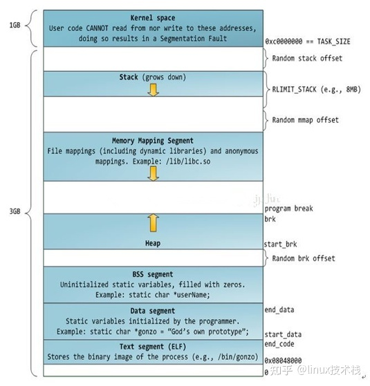

# linux进程&线程与Golang协程的异同

## 进程、线程、协程的定义与描述结构
### Linux进程

进程是完整的资源调度的单位。在linux中由task_struct结构表示。在生成task_struct的同时，生成两个栈，
 - 用户栈，位于用户地址空间；
 - 内核栈，位于内核空间。
当进程在用户地址空间中执行的时候，使用的是用户栈，CPU堆栈指针寄存器中存的是用户栈的地址。当进程在内核空间执行时，CPU堆栈指针寄存器中放的是内核栈的地址。

Linux进程由一个独特的PID标识。由链表串联起来。linux进程由明确的父子进程关系，所有进程都是由某个进程clone/fork出来的。

子进程创建后并不立即分配内存，而是采用写时拷贝的方式，即在子进程需要修改的时候才去拷贝。

Linux的进程的地址空间在32位系统上的构成如下， 地址空间由高到低：

### linux 轻量级进程
本质上，linux轻量级进程是一个进程。linux在调度的时候，不区分轻量级进程和普通进程。轻量级线程也是有task_struct结构的。但是它和父进程共享一些资源，例如之空间和打开的文件等等。

linux 轻量级进程由clone系统调用创建。

### Goroutine
**原理**

- G：goroutinues go协程，待执行的任务
- M：线程，由操作系统管理和调度
- P：处理器，可被看作是运行在线程上的调度器

P管理着一个G的队列，当P和M绑定时，P可以从本地G队列中选择一个绑定到M上执行。同时，也存在着一个全局的G的队列。

- 对于全局的G，需要加锁进行保护
- 对于本地的G，不需要加锁

#### 触发调度的时机

- 主动挂起 — [`runtime.gopark`](https://draveness.me/golang/tree/runtime.gopark) -> [`runtime.park_m`](https://draveness.me/golang/tree/runtime.park_m)
- 系统调用 — [`runtime.exitsyscall`](https://draveness.me/golang/tree/runtime.exitsyscall) -> [`runtime.exitsyscall0`](https://draveness.me/golang/tree/runtime.exitsyscall0)
- 协作式调度 — [`runtime.Gosched`](https://draveness.me/golang/tree/runtime.Gosched) -> [`runtime.gosched_m`](https://draveness.me/golang/tree/runtime.gosched_m) -> [`runtime.goschedImpl`](https://draveness.me/golang/tree/runtime.goschedImpl)
- 系统监控 — [`runtime.sysmon`](https://draveness.me/golang/tree/runtime.sysmon) -> [`runtime.retake`](https://draveness.me/golang/tree/runtime.retake) -> [`runtime.preemptone`](https://draveness.me/golang/tree/runtime.preemptone)

**常见面试问题**：

- Q：for死循环会怎么样？
  - 早期不是基于信号的抢占的版本中（1.14之前），若执行for{i++}，则永远也无法被调度。基于信号的抢占之后，‘首先注册绑定 SIGURG 信号及处理方法runtime.doSigPreempt，sysmon会间隔性检测超时的p，然后发送信号，m收到信号后休眠执行的goroutine并且进行重新调度’

## Reference 

https://www.zhihu.com/question/24485648/answer/2517277530
https://blog.csdn.net/zhoutianzi12/article/details/107004837
https://studygolang.com/articles/22010

