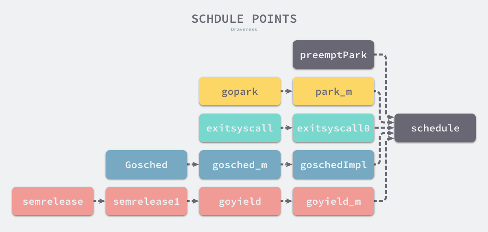

<!-- START doctoc generated TOC please keep comment here to allow auto update -->

<!-- DON'T EDIT THIS SECTION, INSTEAD RE-RUN doctoc TO UPDATE -->

**Table of Contents**  *generated with [DocToc](https://github.com/thlorenz/doctoc)*

- [Golang](#golang)
  - [基础](#%E5%9F%BA%E7%A1%80)
    - [Array](#array)
    - [Slice<sup>1</sup>](#slicesup1sup)
      - [拷贝](#%E6%8B%B7%E8%B4%9D)
      - [扩容](#%E6%89%A9%E5%AE%B9)
    - [Hash表](#hash%E8%A1%A8)
      - [golang 如何创建一个map](#golang-%E5%A6%82%E4%BD%95%E5%88%9B%E5%BB%BA%E4%B8%80%E4%B8%AAmap)
    - [String](#string)
    - [函数](#%E5%87%BD%E6%95%B0)
      - [闭包](#%E9%97%AD%E5%8C%85)
    - [接口](#%E6%8E%A5%E5%8F%A3)
    - [反射](#%E5%8F%8D%E5%B0%84)
    - [for range](#for-range)
    - [defer & panic & recover](#defer--panic--recover)
    - [make & new](#make--new)
  - [调度](#%E8%B0%83%E5%BA%A6)
    - [Context](#context)
    - [同步原语](#%E5%90%8C%E6%AD%A5%E5%8E%9F%E8%AF%AD)
    - [channel](#channel)
    - [GMP模型](#gmp%E6%A8%A1%E5%9E%8B)
      - [原理](#%E5%8E%9F%E7%90%86)
      - [触发调度的时机](#%E8%A7%A6%E5%8F%91%E8%B0%83%E5%BA%A6%E7%9A%84%E6%97%B6%E6%9C%BA)
  - [内存分配](#%E5%86%85%E5%AD%98%E5%88%86%E9%85%8D)
    - [堆内存分配](#%E5%A0%86%E5%86%85%E5%AD%98%E5%88%86%E9%85%8D)
    - [垃圾回收(更新到1.8)](#%E5%9E%83%E5%9C%BE%E5%9B%9E%E6%94%B6%E6%9B%B4%E6%96%B0%E5%88%B018)
      - [原理](#%E5%8E%9F%E7%90%86-1)
        - [三色抽象](#%E4%B8%89%E8%89%B2%E6%8A%BD%E8%B1%A1)
        - [三色不变性](#%E4%B8%89%E8%89%B2%E4%B8%8D%E5%8F%98%E6%80%A7)
        - [写屏障](#%E5%86%99%E5%B1%8F%E9%9A%9C)
      - [GC阶段](#gc%E9%98%B6%E6%AE%B5)
      - [GC的时机](#gc%E7%9A%84%E6%97%B6%E6%9C%BA)
      - [GC 调优](#gc-%E8%B0%83%E4%BC%98)
    - [栈内存分配](#%E6%A0%88%E5%86%85%E5%AD%98%E5%88%86%E9%85%8D)
  - [性能优化](#%E6%80%A7%E8%83%BD%E4%BC%98%E5%8C%96)
    - [pprof](#pprof)
    - [trace](#trace)
      - [String & []Byte](#string--byte)
        - [尽量避免[]byte 和 string相互转换](#%E5%B0%BD%E9%87%8F%E9%81%BF%E5%85%8Dbyte-%E5%92%8C-string%E7%9B%B8%E4%BA%92%E8%BD%AC%E6%8D%A2)
        - [拼接](#%E6%8B%BC%E6%8E%A5)
      - [map和syncMap](#map%E5%92%8Csyncmap)
      - [正则化&JSON序列化](#%E6%AD%A3%E5%88%99%E5%8C%96json%E5%BA%8F%E5%88%97%E5%8C%96)
  - [标准库](#%E6%A0%87%E5%87%86%E5%BA%93)
    - [math](#math)
      - [rand：](#rand)
    - [sync](#sync)
      - [map](#map)
  - [面经](#%E9%9D%A2%E7%BB%8F)
    - [channel的实现](#channel%E7%9A%84%E5%AE%9E%E7%8E%B0)
    - [golang 的GMP模型](#golang-%E7%9A%84gmp%E6%A8%A1%E5%9E%8B)
    - [线程和协程的堆栈的异同](#%E7%BA%BF%E7%A8%8B%E5%92%8C%E5%8D%8F%E7%A8%8B%E7%9A%84%E5%A0%86%E6%A0%88%E7%9A%84%E5%BC%82%E5%90%8C)
    - [GOROUTINE 的优势，它的轻量级体现在哪](#goroutine-%E7%9A%84%E4%BC%98%E5%8A%BF%E5%AE%83%E7%9A%84%E8%BD%BB%E9%87%8F%E7%BA%A7%E4%BD%93%E7%8E%B0%E5%9C%A8%E5%93%AA)
    - [如何理解“不要用共享内存来通信，要用通信来共享内存“](#%E5%A6%82%E4%BD%95%E7%90%86%E8%A7%A3%E4%B8%8D%E8%A6%81%E7%94%A8%E5%85%B1%E4%BA%AB%E5%86%85%E5%AD%98%E6%9D%A5%E9%80%9A%E4%BF%A1%E8%A6%81%E7%94%A8%E9%80%9A%E4%BF%A1%E6%9D%A5%E5%85%B1%E4%BA%AB%E5%86%85%E5%AD%98)
    - [golang闭包](#golang%E9%97%AD%E5%8C%85)
  - [框架](#%E6%A1%86%E6%9E%B6)
    - [介绍一下gin框架并且与原生的net/http比较](#%E4%BB%8B%E7%BB%8D%E4%B8%80%E4%B8%8Bgin%E6%A1%86%E6%9E%B6%E5%B9%B6%E4%B8%94%E4%B8%8E%E5%8E%9F%E7%94%9F%E7%9A%84nethttp%E6%AF%94%E8%BE%83)
  - [其他](#%E5%85%B6%E4%BB%96)
    - [为什么要选择GO](#%E4%B8%BA%E4%BB%80%E4%B9%88%E8%A6%81%E9%80%89%E6%8B%A9go)
    - [Go的优缺点](#go%E7%9A%84%E4%BC%98%E7%BC%BA%E7%82%B9)
    - [Go语言与C语言的优缺点](#go%E8%AF%AD%E8%A8%80%E4%B8%8Ec%E8%AF%AD%E8%A8%80%E7%9A%84%E4%BC%98%E7%BC%BA%E7%82%B9)
    - [GDB调试](#gdb%E8%B0%83%E8%AF%95)
    - [常用命令](#%E5%B8%B8%E7%94%A8%E5%91%BD%E4%BB%A4)
  - [Reference](#reference)

<!-- END doctoc generated TOC please keep comment here to allow auto update -->

# Golang

## 基础

### Array

1. 当元素数量小于或者等于 4 个时，会直接将数组中的元素放置在栈上；
2. 当元素数量大于 4 个时，会将数组中的元素放置到静态区并在运行时取出；

### [Slice](https://draveness.me/golang/docs/part2-foundation/ch03-datastructure/golang-array-and-slice/)[<sup>1</sup>](#refer)

slice是一个结构体，在数组上提供了一层抽象

```go
type SliceHeader struct {
    Data uintptr
    Len  int
    Cap  int
}

// len(slice) or cap(slice) 获取容量
```

#### 拷贝

```go
copy(a,b)

// 编译时拷贝
n := len(a)
if n > len(b) {
    n = len(b)
}
if a.ptr != b.ptr {
    memmove(a.ptr, b.ptr, n*sizeof(elem(a))) 
}

// 运行时拷贝
func slicecopy(to, fm slice, width uintptr) int {
    if fm.len == 0 || to.len == 0 {
        return 0
    }
    n := fm.len
    if to.len < n {
        n = to.len
    }
    if width == 0 {
        return n
    }
    ...

    size := uintptr(n) * width
    if size == 1 {
        *(*byte)(to.array) = *(*byte)(fm.array)
    } else {
        memmove(to.array, fm.array, size)
    }
    return n
}

// 都采用了memmove 整块拷贝内存到目标地址，相比于逐个拷贝数组元素，效率更高
// TODO： Mememove实现？
```

#### [扩容](https://juejin.cn/post/6844903812331732999)

扩容会发生在slice append的时候，当slice的cap不足以容纳新元素，就会进行growSlice。

```go
// 常规操作
func growslice(et *_type, old slice, cap int) slice {

    // 省略一些判断...

    newcap := old.cap
    doublecap := newcap + newcap
    if cap > doublecap {
        newcap = cap
    } else {
        if old.len < 1024 {
            newcap = doublecap
        } else {
            // Check 0 < newcap to detect overflow
            // and prevent an infinite loop.
            for 0 < newcap && newcap < cap {
                newcap += newcap / 4
            }
            // Set newcap to the requested cap when
            // the newcap calculation overflowed.
            if newcap <= 0 {
                newcap = cap
            }
        }
    }
    // 省略一些后续...
}
```

实际操作：append的时候发生扩容的动作

- append单个元素，或者append少量的多个元素，这里的少量指double之后的容量能容纳，这样就会走以下扩容流程，不足1024，双倍扩容，超过1024的，1.25倍扩容。
- 若是append多个元素，且double后的容量不能容纳，直接使用预估的容量。

**敲重点！！！！此外，以上两个分支得到新容量后，均需要根据slice的类型size，算出新的容量所需的内存情况`capmem`，然后再进行`capmem`向上取整，得到新的所需内存，除上类型size，得到真正的最终容量,作为新的slice的容量。**

<details>
<summary><strong>如何实现栈和队列</strong></summary>
1.  通过slice实现，入栈出栈可以使用切片来实现。但是有内存泄漏的风险
2.  利用标准库里面的container/link（双向链表） 来实现，**不保证线程安全**
container包中包含三个主要的东西，一个是heap 定义了一些接口，需要用户自己去实现，接口内部嵌入了sort包的中的接口。
还有一个是link 双向链表，最后一个是ring
</details>

### [Hash表](https://draveness.me/golang/docs/part2-foundation/ch03-datastructure/golang-hashmap/)

#### golang 如何创建一个map

字面量或者make

#### hash冲突的解决

- 开放地址法：在数组中的下一个位置填充
  - Q：若填充位置阻碍了下一个hash怎么办？
- 拉链法：用链表来存储冲突的元素
  - 装载因子 = 元素数量/桶的数量

#### Hash 实现

KeyPoints:

- ### String

不可变字符串，结构如下

```go
type StringHeader struct {
    Data uintptr  // 指向底层string
    Len  int            // 长度
}
```

需要转换为[]byte 类型进行修改，[]byte类型也可以转换为string 类型，都需要发生内存拷贝，因此为造成性能损失

### 函数

函数是一等公民：

- c语言函数传递参数和返回值使用寄存器和栈共同来操作，返回值只使用一个栈，所以不支持多返回值。GO语言使用栈来进行参数的传递与返回，只需要在栈上多分配一些空间即可实现多返回值，但是牺牲了性能。
- go语言值拷贝，传递大的结构体的时候注意使用指针传递； 结构体在内存中是连续的一块区域，指针指向结构体顶部。

#### 闭包

[闭包解释](https://zhuanlan.zhihu.com/p/92634505) **闭包**是由**函数**和与其相关的引用**环境**组合而成的实体 。

**延迟绑定**：在闭包被声明的时候会保存相关的环境，在真正执行的时候才会去读相关环境的值。

### 接口

接口是一些方法签名的集合； 鸭子类型，实现接口的时候不需要指定，在特定时候会进行类型转换进行Check；

- go中的接口分为两种类型：runtime.iface(带有一组方法的接口)，runtime.eface(不带方法的接口)
- 空接口interface{} != nil

<details>
<summary><strong>接口？有什么优劣之处？</strong></summary>
接口：抽象出来的模式或者说是约定，一系列函数签名的合集
优点：非侵入式的，编码起来非常灵活，一般来说在项目开始的时候很难去定义需要哪些接口，go可以随着项目的进行来确定最终需要那些接口
劣势: 相比与侵入式的接口而言，很难确定一个结构提实现了哪些接口，也很难确定哪些接口被实现了。可能存在名称冲突的问题。

如果a接口中包含b，c两个接口，且b，c两个接口中有重名，那么在go1.14 之前会报编译错误，但是在go1.14中修复了这个错误。

</details>

|            | 结构体实现接口 | 结构体指针实现接口 |
|:----------:|:-------:| --------- |
| 结构体初始化变量   | 通过      | 不通过       |
| 结构体指针初始化变量 | 通过      | 通过        |

### 反射

反射给Go提供了元编程的能力；Go中的反射主要集中于两种reflect.Type 和reflect.Value，可以使用提供的reflect.TypeOf和reflect.ValueOf来获取变量类型。

### for range

```go
// 第一个例子
func main() {
    arr := []int{1, 2, 3}
    for _, v := range arr {
        arr = append(arr, v)
    }
    fmt.Println(arr)
}

$ go run main.go
1 2 3 1 2 3

// 第二个例子
func main() {
    arr := []int{1, 2, 3}
    newArr := []*int{}
    for _, v := range arr {
        newArr = append(newArr, &v)
    }
    for _, v := range newArr {
        fmt.Println(*v)
    }
}

$ go run main.go
3 3 3
```

**针对于遍历切片，运行时会被替换为**：

```go
ha := a
hv1 := 0
hn := len(ha)
v1 := hv1
for ; hv1 < hn; hv1++ {
    ...
}

/**
....
**/

ha := a
hv1 := 0
hn := len(ha)
v1 := hv1
v2 := nil
for ; hv1 < hn; hv1++ {
    tmp := ha[hv1]
    v1, v2 = hv1, tmp
    ...
}
```

即：会用新的变量来替换原来的数组，并且循环内部会复用元素，因此要注意变量的作用域

**对于字符串**

```go
ha := s
for hv1 := 0; hv1 < len(ha); {
    hv1t := hv1
    hv2 := rune(ha[hv1])  // 将字符数组转换为rune类型
    if hv2 < utf8.RuneSelf {
        hv1++
    } else {
        hv2, hv1 = decoderune(ha, hv1)
    }
    v1, v2 = hv1t, hv2
}
```

**针对于Map**：编译时会插入一个随机数，来决定开始遍历的起点

**针对Channel** ：

```go
for v := range ch {} 

// 展开
ha := a
hv1, hb := <-ha
for ; hb != false; hv1, hb = <-ha {
    v1 := hv1
    hv1 = nil
    ...
}
```

### defer & panic & recover


`defer` 关键字的实现主要依靠编译器和运行时的协作，我们总结一下本节提到的三种机制：

- 堆上分配 · 1.1 ~ 1.12
  - 编译期将 `defer` 关键字被转换 [`runtime.deferproc`](https://draveness.me/golang/tree/runtime.deferproc) 并在调用 `defer` 关键字的函数返回之前插入 [`runtime.deferreturn`](https://draveness.me/golang/tree/runtime.deferreturn)；
  - 运行时调用 [`runtime.deferproc`](https://draveness.me/golang/tree/runtime.deferproc) 会将一个新的 [`runtime._defer`](https://draveness.me/golang/tree/runtime._defer) 结构体追加到当前 Goroutine 的链表头；
  - 运行时调用 [`runtime.deferreturn`](https://draveness.me/golang/tree/runtime.deferreturn) 会从 Goroutine 的链表中取出 [`runtime._defer`](https://draveness.me/golang/tree/runtime._defer) 结构并依次执行；
- 栈上分配 · 1.13
  - 当该关键字在函数体中最多执行一次时，编译期间的 [`cmd/compile/internal/gc.state.call`](https://draveness.me/golang/tree/cmd/compile/internal/gc.state.call) 会将结构体分配到栈上并调用 [`runtime.deferprocStack`](https://draveness.me/golang/tree/runtime.deferprocStack)；
- 开放编码 · 1.14 ~ 现在
  - 编译期间判断 `defer` 关键字、`return` 语句的个数确定是否开启开放编码优化；
  - 通过 `deferBits` 和 [`cmd/compile/internal/gc.openDeferInfo`](https://draveness.me/golang/tree/cmd/compile/internal/gc.openDeferInfo) 存储 `defer` 关键字的相关信息；
  - 如果 `defer` 关键字的执行可以在编译期间确定，会在函数返回前直接插入相应的代码，否则会由运行时的 [`runtime.deferreturn`](https://draveness.me/golang/tree/runtime.deferreturn) 处理；

我们在本节前面提到的两个现象在这里也可以解释清楚了：

- 后调用的defer函数会先执行：
  - 后调用的 `defer` 函数会被追加到 Goroutine `_defer` 链表的最前面；
  - 运行 [`runtime._defer`](https://draveness.me/golang/tree/runtime._defer) 时是从前到后依次执行；
- 函数的参数会被预先计算；
  - 调用 [`runtime.deferproc`](https://draveness.me/golang/tree/runtime.deferproc) 函数创建新的延迟调用时就会立刻拷贝函数的参数，函数的参数不会等到真正执行时计算；

**panic & recover**

分析程序的崩溃和恢复过程比较棘手，代码不是特别容易理解。我们在本节的最后还是简单总结一下程序崩溃和恢复的过程：

1. 编译器会负责做转换关键字的工作；
   1. 将 `panic` 和 `recover` 分别转换成 [`runtime.gopanic`](https://draveness.me/golang/tree/runtime.gopanic) 和 [`runtime.gorecover`](https://draveness.me/golang/tree/runtime.gorecover)；
   2. 将 `defer` 转换成 [`runtime.deferproc`](https://draveness.me/golang/tree/runtime.deferproc) 函数；
   3. 在调用 `defer` 的函数末尾调用 [`runtime.deferreturn`](https://draveness.me/golang/tree/runtime.deferreturn) 函数；
2. 在运行过程中遇到 [`runtime.gopanic`](https://draveness.me/golang/tree/runtime.gopanic) 方法时，会从 Goroutine 的链表依次取出 [`runtime._defer`](https://draveness.me/golang/tree/runtime._defer) 结构体并执行；
3. 如果调用延迟执行函数时遇到了runtime.gorecover就会将_panic.recovered标记成 true 并返回panic的参数；
   1. 在这次调用结束之后，[`runtime.gopanic`](https://draveness.me/golang/tree/runtime.gopanic) 会从 [`runtime._defer`](https://draveness.me/golang/tree/runtime._defer) 结构体中取出程序计数器 `pc` 和栈指针 `sp` 并调用 [`runtime.recovery`](https://draveness.me/golang/tree/runtime.recovery) 函数进行恢复程序；
   2. [`runtime.recovery`](https://draveness.me/golang/tree/runtime.recovery) 会根据传入的 `pc` 和 `sp` 跳转回 [`runtime.deferproc`](https://draveness.me/golang/tree/runtime.deferproc)；
   3. 编译器自动生成的代码会发现 [`runtime.deferproc`](https://draveness.me/golang/tree/runtime.deferproc) 的返回值不为 0，这时会跳回 [`runtime.deferreturn`](https://draveness.me/golang/tree/runtime.deferreturn) 并恢复到正常的执行流程；
4. 如果没有遇到 [`runtime.gorecover`](https://draveness.me/golang/tree/runtime.gorecover) 就会依次遍历所有的 [`runtime._defer`](https://draveness.me/golang/tree/runtime._defer)，并在最后调用 [`runtime.fatalpanic`](https://draveness.me/golang/tree/runtime.fatalpanic) 中止程序、打印 `panic` 的参数并返回错误码 2；

分析的过程涉及了很多语言底层的知识，源代码阅读起来也比较晦涩，其中充斥着反常规的控制流程，通过程序计数器来回跳转，不过对于我们理解程序的执行流程还是很有帮助。

### make & new

- `make` 的作用是初始化内置的数据结构，也就是我们在前面提到的切片、哈希表和 Channel；
- `new` 的作用是根据传入的类型分配一片内存空间并返回指向这片内存空间的指针；

## 调度

### Context

[context 详解](https://www.cnblogs.com/qcrao-2018/p/11007503.html)

**接口定义**

```go
type Context interface {
    Deadline() (deadline time.Time, ok bool)
    Done() <-chan struct{}
    Err() error
    Value(key interface{}) interface{}
}
```

**作用**

- 协调多个goroutines，取消一个context时，同级别的context或者子context都会被取消
- 本质上是类似于一个链表结构，取消操作的复杂度是O(n)。由于加了锁，所以context是线程安全的

### 同步原语

[同步 - go语言设计与实现](https://draveness.me/golang/docs/part3-runtime/ch06-concurrency/golang-sync-primitives/)


**Mutex - 互斥锁**

互斥锁的加锁过程比较复杂，它涉及自旋、信号量以及调度等概念：

- 如果互斥锁处于初始化状态，会通过置位 `mutexLocked` 加锁；
- 如果互斥锁处于 `mutexLocked` 状态并且在普通模式下工作，会进入自旋，执行 30 次 `PAUSE` 指令消耗 CPU 时间等待锁的释放；
- 如果当前 Goroutine 等待锁的时间超过了 1ms，互斥锁就会切换到饥饿模式；
- 互斥锁在正常情况下会通过 [`runtime.sync_runtime_SemacquireMutex`](https://draveness.me/golang/tree/runtime.sync_runtime_SemacquireMutex) 将尝试获取锁的 Goroutine 切换至休眠状态，等待锁的持有者唤醒；
- 如果当前 Goroutine 是互斥锁上的最后一个等待的协程或者等待的时间小于 1ms，那么它会将互斥锁切换回正常模式；

互斥锁的解锁过程与之相比就比较简单，其代码行数不多、逻辑清晰，也比较容易理解：

- 当互斥锁已经被解锁时，调用 [`sync.Mutex.Unlock`](https://draveness.me/golang/tree/sync.Mutex.Unlock) 会直接抛出异常；
- 当互斥锁处于饥饿模式时，将锁的所有权交给队列中的下一个等待者，等待者会负责设置 `mutexLocked` 标志位；
- 当互斥锁处于普通模式时，如果没有 Goroutine 等待锁的释放或者已经有被唤醒的 Goroutine 获得了锁，会直接返回；在其他情况下会通过 [`sync.runtime_Semrelease`](https://draveness.me/golang/tree/sync.runtime_Semrelease) 唤醒对应的 Goroutine；

**读写锁 - RWMutex**

读写互斥锁 [`sync.RWMutex`](https://draveness.me/golang/tree/sync.RWMutex) 是细粒度的互斥锁，它不限制资源的并发读，但是读写、写写操作无法并行执行。

|     | 读   | 写   |
|:---:|:---:|:---:|
| 读   | Y   | N   |
| 写   | N   | N   |

**表 6-1 RWMutex 的读写并发**

常见服务的资源读写比例会非常高，因为大多数的读请求之间不会相互影响，所以我们可以分离读写操作，以此来提高服务的性能。

[`sync.RWMutex`](https://draveness.me/golang/tree/sync.RWMutex) 中总共包含以下 5 个字段：

```go
type RWMutex struct {
    w           Mutex
    writerSem   uint32
    readerSem   uint32
    readerCount int32
    readerWait  int32
}
```

- `w` — 复用互斥锁提供的能力；
- `writerSem` 和 `readerSem` — 分别用于写等待读和读等待写：
- `readerCount` 存储了当前正在执行的读操作数量；
- `readerWait` 表示当写操作被阻塞时等待的读操作个数；

我们会依次分析获取写锁和读锁的实现原理，其中：

- 写操作使用 [`sync.RWMutex.Lock`](https://draveness.me/golang/tree/sync.RWMutex.Lock) 和 [`sync.RWMutex.Unlock`](https://draveness.me/golang/tree/sync.RWMutex.Unlock) 方法；
- 读操作使用 [`sync.RWMutex.RLock`](https://draveness.me/golang/tree/sync.RWMutex.RLock) 和 [`sync.RWMutex.RUnlock`](https://draveness.me/golang/tree/sync.RWMutex.RUnlock) 方法；

虽然读写互斥锁 [`sync.RWMutex`](https://draveness.me/golang/tree/sync.RWMutex) 提供的功能比较复杂，但是因为它建立在 [`sync.Mutex`](https://draveness.me/golang/tree/sync.Mutex) 上，所以实现会简单很多。我们总结一下读锁和写锁的关系：

- 调用`sync.RWMutex.Lock`尝试获取写锁时；
  - 每次 [`sync.RWMutex.RUnlock`](https://draveness.me/golang/tree/sync.RWMutex.RUnlock) 都会将 `readerCount` 其减一，当它归零时该 Goroutine 会获得写锁；
  - 将 `readerCount` 减少 `rwmutexMaxReaders` 个数以阻塞后续的读操作；
- 调用 [`sync.RWMutex.Unlock`](https://draveness.me/golang/tree/sync.RWMutex.Unlock) 释放写锁时，会先通知所有的读操作，然后才会释放持有的互斥锁；

读写互斥锁在互斥锁之上提供了额外的更细粒度的控制，能够在读操作远远多于写操作时提升性能。

**WaitGroup**

**Once**

**Cond**

**Other**

[`golang/sync/errgroup.Group`](https://draveness.me/golang/tree/golang/sync/errgroup.Group)、[`golang/sync/semaphore.Weighted`](https://draveness.me/golang/tree/golang/sync/semaphore.Weighted) 和 [`golang/sync/singleflight.Group`](https://draveness.me/golang/tree/golang/sync/singleflight.Group)

### channel

[chanel - go语言设计与实现](https://draveness.me/golang/docs/part3-runtime/ch06-concurrency/golang-channel/#643-创建管道)

**基本的数据结构**

```go
type hchan struct {
    qcount   uint
    dataqsiz uint
    buf      unsafe.Pointer
    elemsize uint16
    closed   uint32
    elemtype *_type
    sendx    uint
    recvx    uint
    recvq    waitq
    sendq    waitq

    lock mutex
}
```

结构体中的五个字段 `qcount`、`dataqsiz`、`buf`、`sendx`、`recv` 构建底层的循环队列：

- `qcount` — Channel 中的元素个数；
- `dataqsiz` — Channel 中的循环队列的长度；
- `buf` — Channel 的缓冲区数据指针；
- `sendx` — Channel 的发送操作处理到的位置；
- `recvx` — Channel 的接收操作处理到的位置；

除此之外，`elemsize` 和 `elemtype` 分别表示当前 Channel 能够收发的元素类型和大小；`sendq` 和 `recvq` 存储了当前 Channel 由于缓冲区空间不足而阻塞的 Goroutine 列表，这些等待队列使用双向链表 [`runtime.waitq`](https://draveness.me/golang/tree/runtime.waitq) 表示，链表中所有的元素都是 [`runtime.sudog`](https://draveness.me/golang/tree/runtime.sudog) 结构：

```go
type waitq struct {
    first *sudog
    last  *sudog
}
```

[`runtime.sudog`](https://draveness.me/golang/tree/runtime.sudog) 表示一个在等待列表中的 Goroutine，该结构中存储了两个分别指向前后 [`runtime.sudog`](https://draveness.me/golang/tree/runtime.sudog) 的指针以构成链表。

### GMP模型

#### 原理

- G：goroutinues go协程，待执行的任务
- M：线程，由操作系统管理和调度
- P：处理器，可被看作是运行在线程上的调度器

P管理着一个G的队列，当P和M绑定时，P可以从本地G队列中选择一个绑定到M上执行。同时，也存在着一个全局的G的队列。

- 对于全局的G，需要加锁进行保护
- 对于本地的G，不需要加锁

#### 触发调度的时机



- 主动挂起 — [`runtime.gopark`](https://draveness.me/golang/tree/runtime.gopark) -> [`runtime.park_m`](https://draveness.me/golang/tree/runtime.park_m)
- 系统调用 — [`runtime.exitsyscall`](https://draveness.me/golang/tree/runtime.exitsyscall) -> [`runtime.exitsyscall0`](https://draveness.me/golang/tree/runtime.exitsyscall0)
- 协作式调度 — [`runtime.Gosched`](https://draveness.me/golang/tree/runtime.Gosched) -> [`runtime.gosched_m`](https://draveness.me/golang/tree/runtime.gosched_m) -> [`runtime.goschedImpl`](https://draveness.me/golang/tree/runtime.goschedImpl)
- 系统监控 — [`runtime.sysmon`](https://draveness.me/golang/tree/runtime.sysmon) -> [`runtime.retake`](https://draveness.me/golang/tree/runtime.retake) -> [`runtime.preemptone`](https://draveness.me/golang/tree/runtime.preemptone)

**常见面试问题**：

- Q：for死循环会怎么样？
  - 早期不是基于信号的抢占的版本中（1.14之前），若执行for{i++}，则永远也无法被调度。基于信号的抢占之后，‘首先注册绑定 SIGURG 信号及处理方法runtime.doSigPreempt，sysmon会间隔性检测超时的p，然后发送信号，m收到信号后休眠执行的goroutine并且进行重新调度’
- 

## 内存分配

当我们谈论内存分配的时候，主要谈论的是两块，堆内存是怎么分配的，栈内存是怎么分配的。对于堆内存而言，我们还需要讨论的是，内存的回收。对于栈内存而言，由于运行时会动态的入栈和出栈，因此不需要去回收内存。

### 堆内存分配

go对内存的组织是按照层级划分的：


**优点**：可以很快的找到需要分配的区域

**缺点：**精度比较低

**内存布局**


### 垃圾回收(更新到1.8)

[参考答案](https://draveness.me/golang/docs/part3-runtime/ch07-memory/golang-garbage-collector/#标记清除)

[GC20问](https://mp.weixin.qq.com/s/o2oMMh0PF5ZSoYD0XOBY2Q)

#### 原理

##### 三色抽象

- 白色对象 — 潜在的垃圾，其内存可能会被垃圾收集器回收；
- 黑色对象 — 活跃的对象，包括不存在任何引用外部指针的对象以及从根对象可达的对象；
- 灰色对象 — 活跃的对象，因为存在指向白色对象的外部指针，垃圾收集器会扫描这些对象的子对象；

在垃圾收集器开始工作时，程序中不存在任何的黑色对象，垃圾收集的根对象会被标记成灰色，垃圾收集器只会从灰色对象集合中取出对象开始扫描，当灰色集合中不存在任何对象时，标记阶段就会结束。


三色标记垃圾收集器的工作原理很简单，我们可以将其归纳成以下几个步骤：

1. 从灰色对象的集合中选择一个灰色对象并将其标记成黑色；
2. 将黑色对象指向的所有对象都标记成灰色，保证该对象和被该对象引用的对象都不会被回收；
3. 重复上述两个步骤直到对象图中不存在灰色对象；

当三色的标记清除的标记阶段结束之后，应用程序的堆中就不存在任何的灰色对象，我们只能看到黑色的存活对象以及白色的垃圾对象，垃圾收集器可以回收这些白色的垃圾，下面是使用三色标记垃圾收集器执行标记后的堆内存，堆中只有对象 D 为待回收的垃圾：

**本身并不支持并发**

##### 三色不变性

想要在并发或者增量的标记算法中保证正确性，我们需要达成以下两种三色不变性（Tri-color invariant）中的一种：

- 强三色不变性 — 黑色对象不会指向白色对象，只会指向灰色对象或者黑色对象；
- 弱三色不变性 — 黑色对象指向的白色对象必须包含一条从灰色对象经由多个白色对象的可达路径[7](https://draveness.me/golang/docs/part3-runtime/ch07-memory/golang-garbage-collector/#fn:7)；

##### 写屏障

**Dijkstra写屏障 - 强三色不变性保证**

```go
writePointer(slot, ptr):
    shade(ptr)
    *slot = ptr
```

**删除写屏障 - 弱三色不变**

在老对象的引用被删除时，将白色的老对象涂成灰色，这样删除写屏障就可以保证弱三色不变性，老对象引用的下游对象一定可以被灰色对象引用。

```go
writePointer(slot, ptr):
    shade(*slot)
    *slot = ptr
```

**混合写屏障**

[官方proposal](https://github.com/golang/proposal/blob/master/design/17503-eliminate-rescan.md)

```go
writePointer(slot, ptr):
    shade(*slot)
    if current stack is grey:
        shade(ptr)
    *slot = ptr
```

1. `shade(*slot)` prevents a mutator from hiding an object by moving the sole pointer to it from the heap to its stack. If it attempts to unlink an object from the heap, this will shade it.
2. `shade(ptr)` prevents a mutator from hiding an object by moving the sole pointer to it from its stack into a black object in the heap. If it attempts to install the pointer into a black object, this will shade it.
3. Once a goroutine's stack is black, the `shade(ptr)` becomes unnecessary. `shade(ptr)` prevents hiding an object by moving it from the stack to the heap, but this requires first having a pointer hidden on the stack. Immediately after a stack is scanned, it only points to shaded objects, so it's not hiding anything, and the `shade(*slot)` prevents it from hiding any other pointers on its stack.

#### GC阶段

1. 清理终止阶段；
   1. **暂停程序**，所有的处理器在这时会进入安全点（Safe point）；
   2. 如果当前垃圾收集循环是强制触发的，我们还需要处理还未被清理的内存管理单元；
2. 标记阶段；
   1. 将状态切换至 `_GCmark`、开启写屏障、用户程序协助（Mutator Assiste）并将根对象入队；
   2. 恢复执行程序，标记进程和用于协助的用户程序会开始并发标记内存中的对象，写屏障会将被覆盖的指针和新指针都标记成灰色，而所有新创建的对象都会被直接标记成黑色；
   3. 开始扫描根对象，包括所有 Goroutine 的栈、全局对象以及不在堆中的运行时数据结构，扫描 Goroutine 栈期间会暂停当前处理器；
   4. 依次处理灰色队列中的对象，将对象标记成黑色并将它们指向的对象标记成灰色；
   5. 使用分布式的终止算法检查剩余的工作，发现标记阶段完成后进入标记终止阶段；
3. 标记终止阶段；
   1. **暂停程序**、将状态切换至 `_GCmarktermination` 并关闭辅助标记的用户程序；
   2. 清理处理器上的线程缓存；
4. 清理阶段；
   1. 将状态切换至 `_GCoff` 开始清理阶段，初始化清理状态并关闭写屏障；
   2. 恢复用户程序，所有新创建的对象会标记成白色；
   3. 后台并发清理所有的内存管理单元，当 Goroutine 申请新的内存管理单元时就会触发清理；

#### GC的时机

 [`runtime.gcTrigger.test`](https://draveness.me/golang/tree/runtime.gcTrigger.test) 方法决定是否需要触发垃圾收集

1. `gcTriggerHeap` — 堆内存的分配达到达控制器计算的触发堆大小；
2. `gcTriggerTime` — 如果一定时间内没有触发，就会触发新的循环，该出发条件由 [`runtime.forcegcperiod`](https://draveness.me/golang/tree/runtime.forcegcperiod) 变量控制，默认为 2 分钟；
3. `gcTriggerCycle` — 如果当前没有开启垃圾收集，则触发新的循环；

#### GC 调优

- 避免大量快速创建goroutine
- 复用已有的内存

### 栈内存分配

由分段栈变为连续栈，栈在运行时需要动态扩容和缩容

## 性能优化

### pprof

### trace

#### String & []Byte

##### 尽量避免[]byte 和 string相互转换

原因在于标准的转换实现都是内存分配+数据拷贝，非常耗费时间

- 尽量避免[]byte和string的互相转换，go的string是不可变类型，标准实现中和[]byte的互转均为值拷贝
- **多数场景下**都可以优先选择强转换方式进行互转，**但只适合于只读的情况**
- **风险**：string强转换后得到的[]byte会fatal error，因为只做了指针转换，这个值还是不可写的
- **风险**：通过强转[]byte得到的string，如果原始[]byte被修改，string的值也对应改变

```go
//强转换
func stringToBytes(s string) []byte {
   x := (*[2]uintptr)(unsafe.Pointer(&s))
   b := [3]uintptr{x[0], x[1], x[1]}
   return *(*[]byte)(unsafe.Pointer(&b))
}

func bytesToString(b []byte) string {
   return *(*string)(unsafe.Pointer(&b))
}
```

Benchmark

```sh
goos: darwin
goarch: amd64

Benchmark_bytesToString    1000000000    0.262 ns/op     0 B/op    0 allocs/op
Benchmark_toString         13166526      84.7 ns/op    512 B/op    1 allocs/op
Benchmark_stringToBytes    1000000000    0.251 ns/op     0 B/op    0 allocs/op
Benchmark_toBytes          12615364      92.9 ns/op    512 B/op    1 allocs/op
```

标准转换实现

```go
/** 基本结构体定义 **/

// slice定义 (src/runtime/slice.go)
type slice struct {
    array unsafe.Pointer
    len   int
    cap   int
}

// string定义 (src/runtime/string.go)
type stringStruct struct {
    str unsafe.Pointer
    len int
}

// string str指向的类型
func gostringnocopy(str *byte) string {
   ss := stringStruct{str: unsafe.Pointer(str), len: findnull(str)}
   s := *(*string)(unsafe.Pointer(&ss))
   return s
}

/** 标准转换实现 **/
// src/runtime/string.go
const tmpStringBufSize = 32
type tmpBuf [tmpStringBufSize]byte

func stringtoslicebyte(buf *tmpBuf, s string) []byte {
   var b []byte
   if buf != nil && len(s) <= len(buf) {
      *buf = tmpBuf{}
      b = buf[:len(s)]
   } else {
      b = rawbyteslice(len(s)) 
   }
   copy(b, s)
   return b
}

// Copy实现
func slicestringcopy(toPtr *byte, toLen int, fm string) int {
   //一些条件判断code...
   n := len(fm)
   memmove(unsafe.Pointer(toPtr), stringStructOf(&fm).str, uintptr(n))
   return n
}

// string([]byte) 实现
func slicebytetostring(buf *tmpBuf, b []byte) (str string) {
    //一些条件判断code...
    var p unsafe.Pointer
    if buf != nil && len(b) <= len(buf) {
        p = unsafe.Pointer(buf)
    } else {
        p = mallocgc(uintptr(len(b)), nil, false)
    }
    stringStructOf(&str).str = p
    stringStructOf(&str).len = len(b)
    //拷贝字节数组至字符串
    memmove(p, (*(*slice)(unsafe.Pointer(&b))).array, uintptr(len(b)))
    return
}
```

##### 拼接

拼接时候建议使用string.Builder 和 Join来实现，Join内部也是使用Builder实现的

[高效拼接测试 一](https://www.flysnow.org/2018/10/28/golang-concat-strings-performance-analysis.html)      [高效拼接测试 二](https://www.flysnow.org/2018/11/05/golang-concat-strings-performance-analysis.html)    [高效拼接测试 三](https://www.flysnow.org/2018/11/11/golang-concat-strings-performance-analysis.html)

#### map和syncMap

- 简单的读多写少场景下，读写分离的syncMap虽然内存分配次数更多，但性能一般好于map+全局rwmutex

#### 正则化&JSON序列化

- 尽量不用，把正则替换为其他等价字符串操作，必须要用把正则表达式提前编译一下会有数十倍提升，做到这一点基本就够了

```go
var phone = "^1[3-9]\d{9}$"
var r = regexp.MustCompile(phone)

func Benchmark_re1(b *testing.B) {
   for i := 0; i < b.N; i++ {
      regexp.MatchString(phone, "13912345678")
   }
}

func Benchmark_re2(b *testing.B) {
   for i := 0; i < b.N; i++ {
      r.MatchString("13912345678")
   }
}

/** benchmark **/
goos: darwin
goarch: amd64

Benchmark_re1     215503       5065 ns/op     5090 B/op     66 allocs/op
Benchmark_re2     8692704       136 ns/op        0 B/op      0 allocs/op
```

## 标准库

### math

#### rand：

使用rand进行负载均衡的时候，如果多个go routine使用的是同一个随机数种子，那么生成的随机数是一样的。

### sync

#### map

## 面经

### channel的实现

### golang 的GMP模型

### 线程和协程的堆栈的异同

### GOROUTINE 的优势，它的轻量级体现在哪

### 如何理解“不要用共享内存来通信，要用通信来共享内存“

[参考答案](https://draveness.me/whys-the-design-communication-shared-memory/)

本质上所有的通信都是通过共享内存来实现的，但不同的通信方式提供的不同的抽象

- 不同的同步机制具有不同的抽象层级；

- 通过消息同步信息能够降低不同组件的耦合；
  
  - channel的设计能在很大程度上降低goroutine的耦合，消息的发送者和消息的接受者不需要自己去获取互斥锁来管理共享资源，只需要发送和读取即可

- 使用消息来共享内存不会导致线程竞争的问题；
  
  - Go 语言选择消息发送的方式，通过保证同一时间只有一个活跃的线程能够访问数据，能够从设计上天然地避免线程竞争和数据冲突的问题；

### golang闭包

## 框架

### 介绍一下gin框架并且与原生的net/http比较

## 其他

### 为什么要选择GO

### Go的优缺点

### Go语言与C语言的优缺点

### [GDB调试](https://github.com/astaxie/build-web-application-with-golang/blob/master/zh/11.2.md)

编译Go程序的时候需要注意以下几点

1. 传递参数-ldflags "-s"，忽略debug的打印信息
2. 传递-gcflags "-N -l" 参数，这样可以忽略Go内部做的一些优化，聚合变量和函数等优化，这样对于GDB调试来说非常困难，所以在编译的时候加入这两个参数避免这些优化。 

gdb插件

1. 生成.gdbinit 文件
2. 添加：add-auto-load-safe-path <your-goroot>/src/runtime/runtime-gdb.py

### 常用命令

GDB的一些常用命令如下所示

- list
  
    简写命令`l`，用来显示源代码，默认显示十行代码，后面可以带上参数显示的具体行，例如：`list 15`，显示十行代码，其中第15行在显示的十行里面的中间，如下所示。
  
        10            time.Sleep(2 * time.Second)
        11            c <- i
        12        }
        13        close(c)
        14    }
        15    
        16    func main() {
        17        msg := "Starting main"
        18        fmt.Println(msg)
        19        bus := make(chan int)

- break
  
    简写命令 `b`,用来设置断点，后面跟上参数设置断点的行数，例如`b 10`在第十行设置断点。

- delete
    简写命令 `d`,用来删除断点，后面跟上断点设置的序号，这个序号可以通过`info breakpoints`获取相应的设置的断点序号，如下是显示的设置断点序号。
  
        Num     Type           Disp Enb Address            What
        2       breakpoint     keep y   0x0000000000400dc3 in main.main at /home/xiemengjun/gdb.go:23
        breakpoint already hit 1 time

- backtrace
  
    简写命令 `bt`,用来打印执行的代码过程，如下所示：
  
        #0  main.main () at /home/xiemengjun/gdb.go:23
        #1  0x000000000040d61e in runtime.main () at /home/xiemengjun/go/src/pkg/runtime/proc.c:244
        #2  0x000000000040d6c1 in schedunlock () at /home/xiemengjun/go/src/pkg/runtime/proc.c:267
        #3  0x0000000000000000 in ?? ()

- info
  
    info命令用来显示信息，后面有几种参数，我们常用的有如下几种：
  
  - `info locals`
    
      显示当前执行的程序中的变量值
  
  - `info breakpoints`
    
      显示当前设置的断点列表
  
  - `info goroutines`
    
      显示当前执行的goroutine列表，如下代码所示,带*的表示当前执行的
    
          * 1  running runtime.gosched
          * 2  syscall runtime.entersyscall
            3  waiting runtime.gosched
            4 runnable runtime.gosched

- print
  
    简写命令`p`，用来打印变量或者其他信息，后面跟上需要打印的变量名，当然还有一些很有用的函数$len()和$cap()，用来返回当前string、slices或者maps的长度和容量。

- whatis 
  
    用来显示当前变量的类型，后面跟上变量名，例如`whatis msg`,显示如下：
  
        type = struct string

- next
  
    简写命令 `n`,用来单步调试，跳到下一步，当有断点之后，可以输入`n`跳转到下一步继续执行

- continue
  
    简称命令 `c`，用来跳出当前断点处，后面可以跟参数N，跳过多少次断点

- set variable
  
    该命令用来改变运行过程中的变量值，格式如：`set variable <var>=<value>`

<div id ="refer"></div>

## Reference

[1] [go语言设计与实现](https://draveness.me/golang/)
