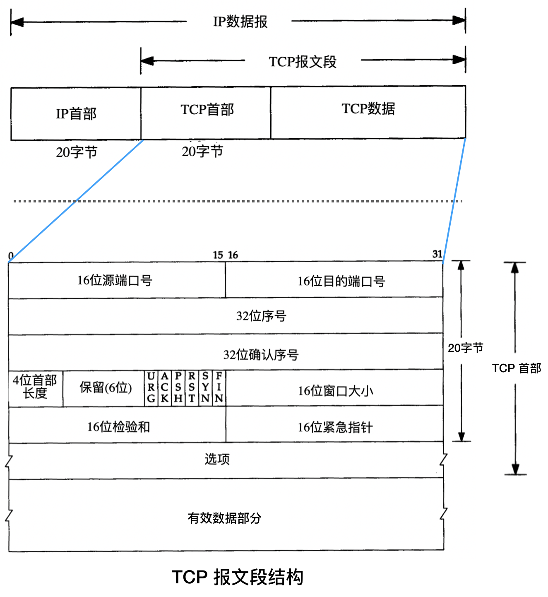
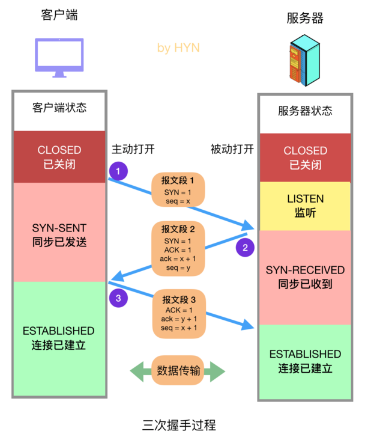
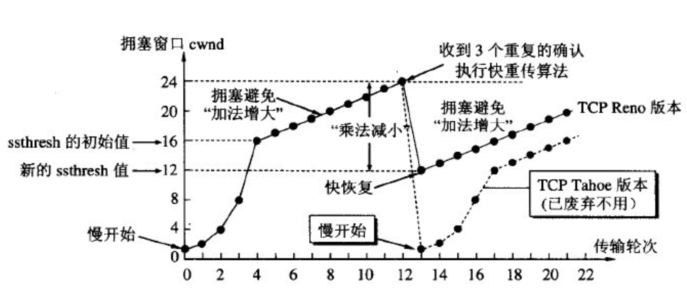
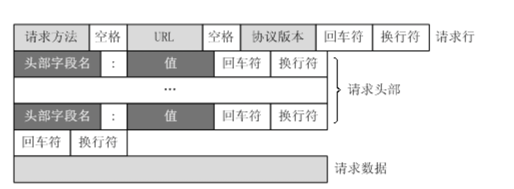
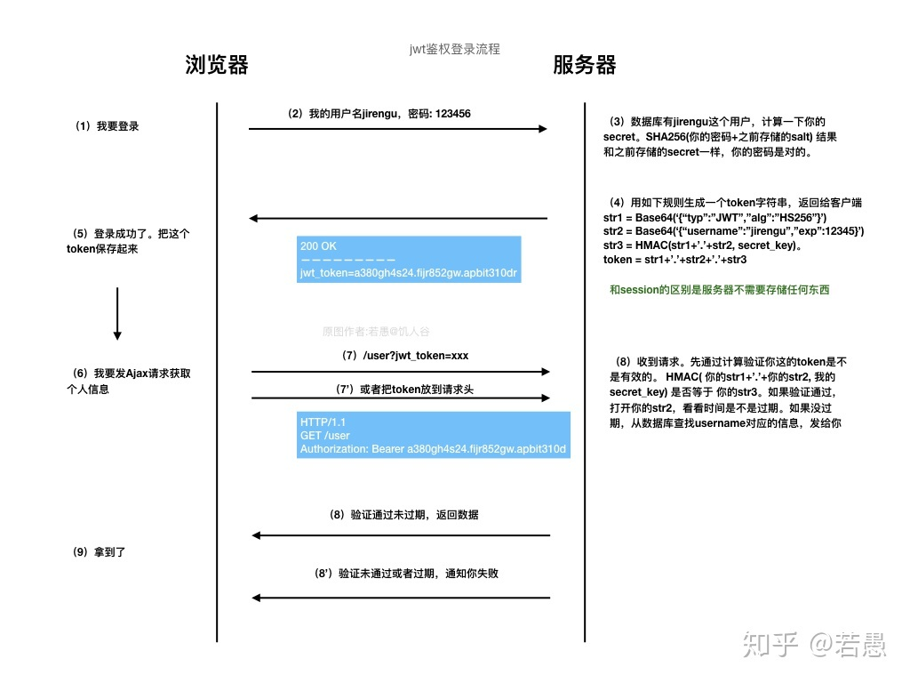
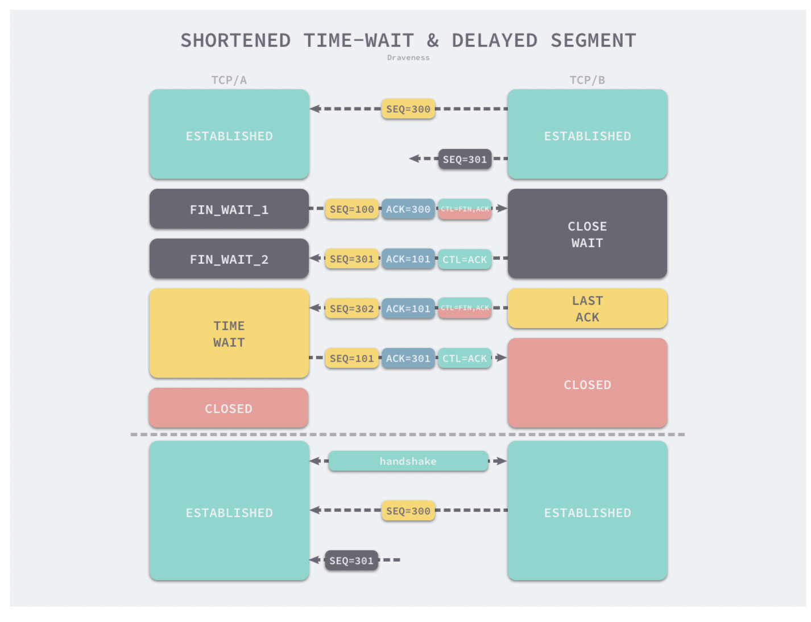
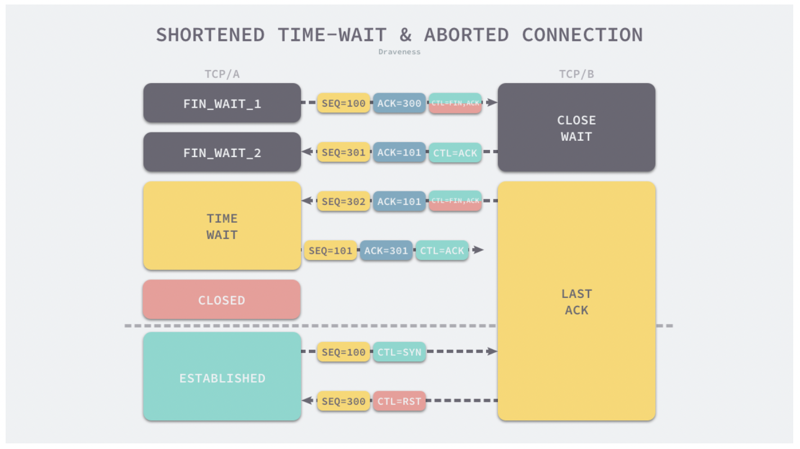

<!-- START doctoc generated TOC please keep comment here to allow auto update -->
<!-- DON'T EDIT THIS SECTION, INSTEAD RE-RUN doctoc TO UPDATE -->
**Table of Contents**  *generated with [DocToc](https://github.com/thlorenz/doctoc)*

- [Network](#network)
  - [网络协议及基本概念](#%E7%BD%91%E7%BB%9C%E5%8D%8F%E8%AE%AE%E5%8F%8A%E5%9F%BA%E6%9C%AC%E6%A6%82%E5%BF%B5)
    - [OSI网络模型](#osi%E7%BD%91%E7%BB%9C%E6%A8%A1%E5%9E%8B)
    - [TCP/UDP](#tcpudp)
      - [**TCP报文段格式**](#tcp%E6%8A%A5%E6%96%87%E6%AE%B5%E6%A0%BC%E5%BC%8F)
      - [**三次握手**](#%E4%B8%89%E6%AC%A1%E6%8F%A1%E6%89%8B)
      - [**四次挥手**](#%E5%9B%9B%E6%AC%A1%E6%8C%A5%E6%89%8B)
      - [**流量控制**](#%E6%B5%81%E9%87%8F%E6%8E%A7%E5%88%B6)
      - [**拥塞控制**](#%E6%8B%A5%E5%A1%9E%E6%8E%A7%E5%88%B6)
        - [TCP的拥塞控制带来的性能问题](#tcp%E7%9A%84%E6%8B%A5%E5%A1%9E%E6%8E%A7%E5%88%B6%E5%B8%A6%E6%9D%A5%E7%9A%84%E6%80%A7%E8%83%BD%E9%97%AE%E9%A2%98)
      - [攻击与防范](#%E6%94%BB%E5%87%BB%E4%B8%8E%E9%98%B2%E8%8C%83)
        - [syn洪范攻击](#syn%E6%B4%AA%E8%8C%83%E6%94%BB%E5%87%BB)
    - [DNS](#dns)
      - [概念](#%E6%A6%82%E5%BF%B5)
      - [查找过程](#%E6%9F%A5%E6%89%BE%E8%BF%87%E7%A8%8B)
    - [HTTP](#http)
      - [HTTP2.0](#http20)
    - [HTTPS](#https)
    - [RPC](#rpc)
    - [JWT](#jwt)
    - [](#)
  - [面经问题](#%E9%9D%A2%E7%BB%8F%E9%97%AE%E9%A2%98)
    - [HTTPS 面试问题](#https-%E9%9D%A2%E8%AF%95%E9%97%AE%E9%A2%98)
      - [https中ssl建立连接的过程](#https%E4%B8%ADssl%E5%BB%BA%E7%AB%8B%E8%BF%9E%E6%8E%A5%E7%9A%84%E8%BF%87%E7%A8%8B)
      - [https握手流程](#https%E6%8F%A1%E6%89%8B%E6%B5%81%E7%A8%8B)
      - [HTTPS为什么要用对称加密+非对称加密+CA机构](#https%E4%B8%BA%E4%BB%80%E4%B9%88%E8%A6%81%E7%94%A8%E5%AF%B9%E7%A7%B0%E5%8A%A0%E5%AF%86%E9%9D%9E%E5%AF%B9%E7%A7%B0%E5%8A%A0%E5%AF%86ca%E6%9C%BA%E6%9E%84)
      - [HTTPS和HTTP的区别](#https%E5%92%8Chttp%E7%9A%84%E5%8C%BA%E5%88%AB)
      - [对称加密和非对称加密](#%E5%AF%B9%E7%A7%B0%E5%8A%A0%E5%AF%86%E5%92%8C%E9%9D%9E%E5%AF%B9%E7%A7%B0%E5%8A%A0%E5%AF%86)
    - [HTTP面试问题](#http%E9%9D%A2%E8%AF%95%E9%97%AE%E9%A2%98)
      - [HTTP请求报文和响应报文的格式](#http%E8%AF%B7%E6%B1%82%E6%8A%A5%E6%96%87%E5%92%8C%E5%93%8D%E5%BA%94%E6%8A%A5%E6%96%87%E7%9A%84%E6%A0%BC%E5%BC%8F)
      - [HTTP状态码有哪些](#http%E7%8A%B6%E6%80%81%E7%A0%81%E6%9C%89%E5%93%AA%E4%BA%9B)
      - [HTTP有哪些方法](#http%E6%9C%89%E5%93%AA%E4%BA%9B%E6%96%B9%E6%B3%95)
      - [Get和Post的区别](#get%E5%92%8Cpost%E7%9A%84%E5%8C%BA%E5%88%AB)
          - [GET请求](#get%E8%AF%B7%E6%B1%82)
          - [POST请求](#post%E8%AF%B7%E6%B1%82)
          - [因此，GET提交的数据会在地址栏中显示出来，而POST提交，地址栏不会改变](#%E5%9B%A0%E6%AD%A4get%E6%8F%90%E4%BA%A4%E7%9A%84%E6%95%B0%E6%8D%AE%E4%BC%9A%E5%9C%A8%E5%9C%B0%E5%9D%80%E6%A0%8F%E4%B8%AD%E6%98%BE%E7%A4%BA%E5%87%BA%E6%9D%A5%E8%80%8Cpost%E6%8F%90%E4%BA%A4%E5%9C%B0%E5%9D%80%E6%A0%8F%E4%B8%8D%E4%BC%9A%E6%94%B9%E5%8F%98)
      - [http1.0 和 2.0](#http10-%E5%92%8C-20)
    - [TCP面试问题](#tcp%E9%9D%A2%E8%AF%95%E9%97%AE%E9%A2%98)
      - [出现大量close_wait的原因](#%E5%87%BA%E7%8E%B0%E5%A4%A7%E9%87%8Fclose_wait%E7%9A%84%E5%8E%9F%E5%9B%A0)
      - [三次握手和四次挥手](#%E4%B8%89%E6%AC%A1%E6%8F%A1%E6%89%8B%E5%92%8C%E5%9B%9B%E6%AC%A1%E6%8C%A5%E6%89%8B)
        - [三次握手](#%E4%B8%89%E6%AC%A1%E6%8F%A1%E6%89%8B)
        - [为什么tcp需要三次握手](#%E4%B8%BA%E4%BB%80%E4%B9%88tcp%E9%9C%80%E8%A6%81%E4%B8%89%E6%AC%A1%E6%8F%A1%E6%89%8B)
        - [四次挥手](#%E5%9B%9B%E6%AC%A1%E6%8C%A5%E6%89%8B)
        - [为什么需要四次挥手](#%E4%B8%BA%E4%BB%80%E4%B9%88%E9%9C%80%E8%A6%81%E5%9B%9B%E6%AC%A1%E6%8C%A5%E6%89%8B)
        - [为什么需要time_wait状态](#%E4%B8%BA%E4%BB%80%E4%B9%88%E9%9C%80%E8%A6%81time_wait%E7%8A%B6%E6%80%81)
        - [time_wait的时间以及查看timeWait的命令](#time_wait%E7%9A%84%E6%97%B6%E9%97%B4%E4%BB%A5%E5%8F%8A%E6%9F%A5%E7%9C%8Btimewait%E7%9A%84%E5%91%BD%E4%BB%A4)
      - [滑动窗口的大小由哪一端来控制？server为什么要控制？client为什么要控制？](#%E6%BB%91%E5%8A%A8%E7%AA%97%E5%8F%A3%E7%9A%84%E5%A4%A7%E5%B0%8F%E7%94%B1%E5%93%AA%E4%B8%80%E7%AB%AF%E6%9D%A5%E6%8E%A7%E5%88%B6server%E4%B8%BA%E4%BB%80%E4%B9%88%E8%A6%81%E6%8E%A7%E5%88%B6client%E4%B8%BA%E4%BB%80%E4%B9%88%E8%A6%81%E6%8E%A7%E5%88%B6)
      - [拥塞控制知道吗？](#%E6%8B%A5%E5%A1%9E%E6%8E%A7%E5%88%B6%E7%9F%A5%E9%81%93%E5%90%97)
    - [其他](#%E5%85%B6%E4%BB%96)
      - [cookies和session的区别](#cookies%E5%92%8Csession%E7%9A%84%E5%8C%BA%E5%88%AB)
      - [session如何存储](#session%E5%A6%82%E4%BD%95%E5%AD%98%E5%82%A8)
      - [分布式session如何实现？](#%E5%88%86%E5%B8%83%E5%BC%8Fsession%E5%A6%82%E4%BD%95%E5%AE%9E%E7%8E%B0)
      - [将session储存在客户端这种方法吗？有什么好处？有什么坏处?](#%E5%B0%86session%E5%82%A8%E5%AD%98%E5%9C%A8%E5%AE%A2%E6%88%B7%E7%AB%AF%E8%BF%99%E7%A7%8D%E6%96%B9%E6%B3%95%E5%90%97%E6%9C%89%E4%BB%80%E4%B9%88%E5%A5%BD%E5%A4%84%E6%9C%89%E4%BB%80%E4%B9%88%E5%9D%8F%E5%A4%84)
      - [浏览器输入URL后经过了哪些过程](#%E6%B5%8F%E8%A7%88%E5%99%A8%E8%BE%93%E5%85%A5url%E5%90%8E%E7%BB%8F%E8%BF%87%E4%BA%86%E5%93%AA%E4%BA%9B%E8%BF%87%E7%A8%8B)
      - [启动一个应用，监听一个端口对外服务？启动服务以后，本身没有问题，但是客户端连不到服务？如何诊断？](#%E5%90%AF%E5%8A%A8%E4%B8%80%E4%B8%AA%E5%BA%94%E7%94%A8%E7%9B%91%E5%90%AC%E4%B8%80%E4%B8%AA%E7%AB%AF%E5%8F%A3%E5%AF%B9%E5%A4%96%E6%9C%8D%E5%8A%A1%E5%90%AF%E5%8A%A8%E6%9C%8D%E5%8A%A1%E4%BB%A5%E5%90%8E%E6%9C%AC%E8%BA%AB%E6%B2%A1%E6%9C%89%E9%97%AE%E9%A2%98%E4%BD%86%E6%98%AF%E5%AE%A2%E6%88%B7%E7%AB%AF%E8%BF%9E%E4%B8%8D%E5%88%B0%E6%9C%8D%E5%8A%A1%E5%A6%82%E4%BD%95%E8%AF%8A%E6%96%AD)

<!-- END doctoc generated TOC please keep comment here to allow auto update -->


#  Network

## 网络协议及基本概念

### OSI网络模型

七层网络模型：


### TCP/UDP

[tcp知识](https://segmentfault.com/a/1190000022144695)

|              |                    UDP                     |                  TCP                   |
| :----------: | :----------------------------------------: | :------------------------------------: |
|   是否连接   |                   无连接                   |                面向连接                |
|   是否可靠   |  不可靠，没有确认机制、流量控制和拥塞控制  |  可靠，有确认机制、流量控制和拥塞控制  |
| 连接对象个数 | 支持一对一，一对多，多对一和多对多交互通信 |            只支持一对一通信            |
|   传输方式   |                  面向报文                  |               面向字节流               |
|   首部开销   |           首部开销小，固定8字节            |  首部开销较大，最小20字节，最大60字节  |
|   适用场景   |  适用于实时应用(IP电话、视频会议、直播等)  | 适用于要求可靠传输的应用，如文件传输等 |

#### **TCP报文段格式**



#### **三次握手**



1. 客户端向服务器发送连接请求报文，设置报文段SYN = 1，初始化seq = x。发送完毕之后，客户端进入到SYN-SENT阶段，表示报文已经发送。
2. 服务器监听端口，接收到请求报文，并返回一个请求确认报文。设置报文段SYN = 1， ACK =1， ack = x +1, seq = y ,随后，服务器进入到SYN-RECIEVED
3. 客户端接收到确认报文，返回一个应答报文，设置ACK = 1，ack = y +1. Seq = x +1进入到连接建立阶段。服务器接收到应答报文之后，也进入到连接建立阶段

#### **四次挥手**


#### **流量控制**


#### **拥塞控制**



##### [TCP的拥塞控制带来的性能问题](https://draveness.me/whys-the-design-tcp-performance/)

- TCP使用丢包来判断是否网络存在拥堵，但是，由于无线网络的大福应用，导致这种情况比较常见
- TCP的重传机制可能会重新传输已经接收到的数据包，造成带宽的浪费
- TCP的三次握手机制带来了更多的额外的开销

#### 攻击与防范

##### syn洪范攻击

### DNS

#### 概念

#### 查找过程

### HTTP

[面试之http](https://www.cnblogs.com/zhaobobo001/p/14432801.html)

**请求消息格式**



**回复消息**


#### HTTP2.0

[HTTP2.0基本知识](https://www.zhihu.com/question/34074946)

### HTTPS

[https详解](https://segmentfault.com/a/1190000021494676)

### RPC

### JWT




### 

## 面经问题

### HTTPS 面试问题

#### https中ssl建立连接的过程


> SSL / TLS 握手详细过程

1. **"client hello"消息：**客户端通过发送"client hello"消息向服务器发起握手请求，该消息包含了客户端所支持的 TLS 版本和密码组合以供服务器进行选择，还有一个"client random"随机字符串。
2. **"server hello"消息：**服务器发送"server hello"消息对客户端进行回应，该消息包含了数字证书，服务器选择的密码组合和"server random"随机字符串。
3. **验证：**客户端对服务器发来的证书进行验证，确保对方的合法身份，**验证过程可以细化为以下几个步骤：**
   1. 检查数字签名
   2. 验证证书链 (这个概念下面会进行说明)
   3. 检查证书的有效期
   4. 检查证书的撤回状态 (撤回代表证书已失效)
4. **"premaster secret"字符串：**客户端向服务器发送另一个随机字符串"premaster secret (预主密钥)"，这个字符串是经过服务器的公钥加密过的，只有对应的私钥才能解密。
5. **使用私钥：**服务器使用私钥解密"premaster secret"。
6. **生成共享密钥**：客户端和服务器均使用 client random，server random 和 premaster secret，并通过相同的算法生成相同的共享密钥 **KEY**。
7. **客户端就绪：**客户端发送经过共享密钥 **KEY**加密过的"finished"信号。
8. **服务器就绪：**服务器发送经过共享密钥 **KEY**加密过的"finished"信号。
9. **达成安全通信：**握手完成，双方使用对称加密进行安全通信。

#### https握手流程


#### HTTPS为什么要用对称加密+非对称加密+CA机构 

我的理解是：

- 首先我们希望服务器双方可以使用两者私有的密钥进行数据加密然后通信，但是如何就这一个私有密钥达成一致是一个问题
- 于是我们可以使用非对称加密，经过如上的握手过程，确定好只有双方知道的密钥。这个过程中需要依赖服务器本身就有一个非对称加密的密钥
- ca更加有助于验证身份？一种身份验证的机制：**TODO：**ca的作用

#### HTTPS和HTTP的区别

- 最最重要的区别就是安全性，HTTP 明文传输，不对数据进行加密安全性较差。HTTPS (HTTP + SSL / TLS)的数据传输过程是加密的，安全性较好。
- 使用 HTTPS 协议需要申请 CA 证书，一般免费证书较少，因而需要一定费用。证书颁发机构如：Symantec、Comodo、DigiCert 和 GlobalSign 等。
- HTTP 页面响应速度比 HTTPS 快，这个很好理解，由于加了一层安全层，建立连接的过程更复杂，也要交换更多的数据，难免影响速度。
- 由于 HTTPS 是建构在 SSL / TLS 之上的 HTTP 协议，所以，要比 HTTP 更耗费服务器资源。
- HTTPS 和 HTTP 使用的是完全不同的连接方式，用的端口也不一样，前者是 443，后者是 80。

#### 对称加密和非对称加密


### HTTP面试问题

#### HTTP请求报文和响应报文的格式

**请求报文**

- 方法 url http版本 回车+换行
- 头部字段： 值
  - keep-alive ： true
- 回车 + 换行
- Body

**响应报文**

- http版本好 状态码 状态消息
- 消息报头
- body

#### HTTP状态码有哪些

- 1xx：指示信息 - 表示请求已经接受，继续处理
- 2xx：请求成功被服务端理解和接受；200 ok
- 3xx：重定向
- 4xx：客户端错误 - 请求有语法错误或者请求无法实现
- 5xx：服务端错误 - 服务端未能实现合法需求

```
200 OK                        //客户端请求成功
400 Bad Request               //客户端请求有语法错误，不能被服务器所理解
401 Unauthorized              //请求未经授权，这个状态代码必须和WWW-Authenticate报头域一起使用 
403 Forbidden                 //服务器收到请求，但是拒绝提供服务
404 Not Found                 //请求资源不存在，eg：输入了错误的URL
500 Internal Server Error     //服务器发生不可预期的错误
503 Server Unavailable        //服务器当前不能处理客户端的请求，一段时间后可能恢复正常
```

#### HTTP有哪些方法

```html
GET     请求指定的页面信息，并返回实体主体。
HEAD     类似于get请求，只不过返回的响应中没有具体的内容，用于获取报头
POST     向指定资源提交数据进行处理请求（例如提交表单或者上传文件）。数据被包含在请求体中。POST请求可能会导致新的资源的建立和/或已有资源的修改。
PUT     从客户端向服务器传送的数据取代指定的文档的内容。
DELETE      请求服务器删除指定的页面。
CONNECT     HTTP/1.1协议中预留给能够将连接改为管道方式的代理服务器。
OPTIONS     允许客户端查看服务器的性能。
TRACE     回显服务器收到的请求，主要用于测试或诊断。
```

#### Get和Post的区别

###### GET请求

```
GET /books/?sex=man&name=Professional HTTP/1.1
Host: www.wrox.com
User-Agent: Mozilla/5.0 (Windows; U; Windows NT 5.1; en-US; rv:1.7.6)
Gecko/20050225 Firefox/1.0.1
Connection: Keep-Alive
```

注意最后一行是空行

###### POST请求

```
POST / HTTP/1.1
Host: www.wrox.com
User-Agent: Mozilla/5.0 (Windows; U; Windows NT 5.1; en-US; rv:1.7.6)
Gecko/20050225 Firefox/1.0.1
Content-Type: application/x-www-form-urlencoded
Content-Length: 40
Connection: Keep-Alive

name=Professional%20Ajax&publisher=Wiley
```

1、GET提交，请求的数据会附在URL之后（就是把数据放置在HTTP协议头中），以?分割URL和传输数据，多个参数用&连接；例 如：login.action?name=hyddd&password=idontknow&verify=%E4%BD%A0 %E5%A5%BD。如果数据是英文字母/数字，原样发送，如果是空格，转换为+，如果是中文/其他字符，则直接把字符串用BASE64加密，得出如： %E4%BD%A0%E5%A5%BD，其中％XX中的XX为该符号以16进制表示的ASCII。

POST提交：把提交的数据放置在是HTTP包的包体中。上文示例中红色字体标明的就是实际的传输数据

###### 因此，GET提交的数据会在地址栏中显示出来，而POST提交，地址栏不会改变

2、传输数据的大小：首先声明：HTTP协议没有对传输的数据大小进行限制，HTTP协议规范也没有对URL长度进行限制。

而在实际开发中存在的限制主要有：

**GET**:特定浏览器和服务器对URL长度有限制，例如 IE对URL长度的限制是2083字节(2K+35)。对于其他浏览器，如Netscape、FireFox等，理论上没有长度限制，其限制取决于操作系 统的支持。

因此对于GET提交时，传输数据就会受到URL长度的 限制。

**POST**:由于不是通过URL传值，理论上数据不受 限。但实际各个WEB服务器会规定对post提交数据大小进行限制，Apache、IIS6都有各自的配置。

3、安全性

POST的安全性要比GET的安全性高。比如：通过GET提交数据，用户名和密码将明文出现在URL上，因为(1)登录页面有可能被浏览器缓存；(2)其他人查看浏览器的历史纪录，那么别人就可以拿到你的账号和密码了，除此之外，使用GET提交数据还可能会造成Cross-site request forgery攻击

4、Http get,post,soap协议都是在http上运行的

（1）get：请求参数是作为一个key/value对的序列（查询字符串）附加到URL上的
查询字符串的长度受到web浏览器和web服务器的限制（如IE最多支持2048个字符），不适合传输大型数据集同时，它很不安全

（2）post：请求参数是在http标题的一个不同部分（名为entity body）传输的，这一部分用来传输表单信息，因此必须将Content-type设置为:application/x-www-form- urlencoded。post设计用来支持web窗体上的用户字段，其参数也是作为key/value对传输。
但是：它不支持复杂数据类型，因为post没有定义传输数据结构的语义和规则。

（3）soap：是http post的一个专用版本，遵循一种特殊的xml消息格式
Content-type设置为: text/xml 任何数据都可以xml化。

Http协议定义了很多与服务器交互的方法，最基本的有4种，分别是GET,POST,PUT,DELETE. 一个URL地址用于描述一个网络上的资源，而HTTP中的GET, POST, PUT, DELETE就对应着对这个资源的查，改，增，删4个操作。 我们最常见的就是GET和POST了。GET一般用于获取/查询资源信息，而POST一般用于更新资源信息.

#### http1.0 和 2.0

### TCP面试问题

#### 出现大量close_wait的原因

一种可能的原因是服务端程序忘记了关闭这个端口，忘记发送ack或者fin报文，导致资源一致被占用，需要复查

#### 三次握手和四次挥手

##### 三次握手

##### [为什么tcp需要三次握手](https://draveness.me/whys-the-design-tcp-three-way-handshake/)

**连接的定义**：用于保证可靠性和流控制机制的信息，包括 Socket、序列号以及窗口大小叫做连接。

因此三次握手的目的就是为了就这三个信息达成一致。因此需要讨论的是：

- 通过三次握手才能阻止重复历史连接的初始化；
- 通过三次握手才能对通信双方的初始序列号进行初始化；
- 讨论其他次数握手建立连接的可能性；

**为什么不是四次：**因为握手的过程也是需要交换进行，占用网络资源的。因此，如果说可以用三次来完成连接的建立，那么就没有必要用四次。

所以应当讨论的是，为什么三次是最小的握手次数？

**防止历史连接**：如果是两次握手，那么接收方没办法去确认新到来的连接请求是否是过期的。它只能选择接受或者拒绝连接，而没办法确认时效。

**确认序列号**：由于TCP是一个可靠传输协议，非常依赖初始序列号来确认数据报的顺序以及是否需要发送方重传等等。因此，只有通过三次握手，才可以确认双方的初始序列号。两次握手只能确认发送方的序列号。

##### 四次挥手

##### 为什么需要四次挥手

因为作为全双工的传输协议，通信双方都可以进行数据的传输。当有一方发起终止连接之后，另一方返回确认。但是此时另一方可能还在进行数据的传输，因此需要等待数据传输完成以后，另一方才发起连接断开的报文，终止另一半的连接。

##### 为什么需要time_wait状态

本质上是因为网络的不可靠的。客户端没办法确认服务端是否接收到了响应报文。而一个报文段在网络中最长的存活时间约为2MSL，若客户端在这个时间段内没有接受到服务端新发来的fin报文，则认为服务端正确关闭了连接。否则，重发并重新计时。

**time_wait过短会发生的情况：**

- 接收到延迟的数据

  

- 保证连接的正常关闭



##### time_wait的时间以及查看timeWait的命令

#### 滑动窗口的大小由哪一端来控制？server为什么要控制？client为什么要控制？

#### 拥塞控制知道吗？

### 其他

#### cookies和session的区别

#### session如何存储

#### 分布式session如何实现？

#### 将session储存在[客户端](https://www.nowcoder.com/jump/super-jump/word?word=客户端)这种方法吗？有什么好处？有什么坏处?

#### 浏览器输入URL后经过了哪些过程

[](https://github.com/skyline75489/what-happens-when-zh_CN)

[参考答案](https://segmentfault.com/a/1190000012092552)

1.DNS域名解析；
2.建立TCP连接；
3.发送HTTP请求；
4.服务器处理请求；
5.返回响应结果；
6.关闭TCP连接；
7.浏览器解析HTML；
8.浏览器布局渲染；


#### 启动一个应用，监听一个端口对外服务？启动服务以后，本身没有问题，但是[客户端](https://www.nowcoder.com/jump/super-jump/word?word=客户端)连不到服务？如何诊断？