# Bytedance - tiktok 
- Timeline: 2021/05/26 ～ 2021/08
## 技术栈

- 语言：**Golang**、thrift
- 存储：**Mysql**、ES、**Redis**
- 框架：**Gin**、**Gorm**
- 中间件：RMQ
- 架构：微服务

**公司框架**

- RPC：Kitex 根据rpc定义生成server和client端的代码
- ginex、gorm、rmq等开源包皮库

## 总结与收获

### 流程规范

**开发流程：** 流程的规范是为了规避风险。和开发私人项目时候有很大的不同在于：私底下做项目的时候可能想到要实现什么功能就直接开始写了，没有走一些必要的流程，一个功能点还好，多个功能点可能带来的问题是相互之间交叉造成意外BUG，并会导致其他同学难以上手。但由于个人项目一般较小，因而整体一般处于可控的情况。而在公司里面写代码，一定要注重<u>开发规范</u>。**基本上需要遵循以下步骤**：

1. **和产品拉齐，知道整体需求背景和功能实现**
2. **调研已有的系统和工具，撰写设计文档**
3. **评审设计文档，组内评价+和对接方评价，有问题则记录并修改**
4. **评估开发时间并进行开发**
5. **和对接方进行联合调试、组内代码review**
6. **移交测试**
7. **上线**

通过流程上的规范，来**规避掉整体项目的风险**，尽可能在上线前暴露问题，以免触发线上事故。

整个流程是非常值得学习的，在开发私人项目和参与开源项目的时候，应当尽量使用。

**团队协作**： 厂里面的事情，更多的时候是一个小团队负责一个功能模块，这极其容易带来的问题就是思维狭隘，难以从全局思考。所因此内部的分享会是非常非常重要的机会去从宏观的一个看、角度去大致认识到某一个部门是干什么的。其次是我们要知道，技术和业务之间的关系其实就是设计图纸和建筑方案的关系，两者应当都看一看。

而细化到组内，也是一个或者多个人负责一个小功能或者业务片区，这样的性质很大概率会导致人的思维局限。从长远发展来看，不论是跳槽，还是跟随一个厉害的人创业，都是更好的选项。而其中的核心逻辑是，要保持自身的持续的学习和积累，定期的反思和复盘。非常的重要。

另外沟通交流能力极为重要，简洁明了的使他人明白你的意思，能够有效的节约沟通成本，另外，阶段性的总结和梳理有助于锻炼思维，但最重要在于持续性的积累。

**上线流程与监控：**要对线上环境抱有敬畏之心。具体阐述为：

1. 方案设计时要充分考虑上线的流程以及可能会出现的影响
2. 上线过程中要时刻盯着流程，上线后要观察一段时间监控
3. 出现问题立刻进行回滚，防止线上事故出现

由于会应用到真实的场景，因此很容易造成资损以及商家投诉，真实的对业务产生影响，**因此需要慎之又慎**

### **职场**

**同级关系处理**：和同事之间要保持了良好的正常的沟通交流，注意好边界线。要明白，与同事之间合作和竞争都有，但是整体指导思想是为了整个部门着想。

**上下级关系处理：**和上级打好关系，并不代表着谄媚，要表现出自己的价值，表现出自己有利于推动上级完成自己的绩效考核，这才是核心。

### 心得

**技术方向**

- **撰写技术方案**：要注意对存储的影响，例如，是否对DB的压力增大许多等等。其次需要详细考虑对已有功能的影响，若考虑不周全可能导致方案需要大改。
- **编写代码**：常见的错误需要规避，例如对空指针取值等。其次，需要对功能点进行单元测试，有助于提前排查问题。第三需要注意模块化编写，做好抽象和可读性之间的平衡。

****

## 商品素材

### Feature: 新增直播回放管理页

#### **核心要点：**

1）直播回放，商家后台管理能力，支持自定义选择展示直播片段以及是否开启商详展示

**时序图：**

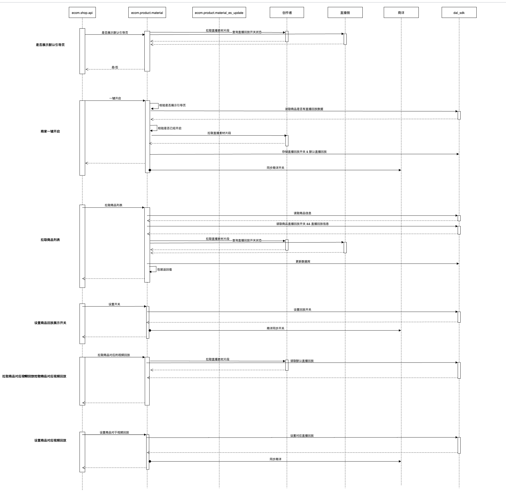

**技术方案阐述：**

从总体上进行功能点的拆分，拆分后大致为如上六个功能点。

1) 
2) 

### Feature:新增白底图采集

#### 核心需求：

1）**商品创建、修改**：新增非必填白底图，支持上传修改

2）**商品详情页**：白底图审核通过则显示，不通过显示原因

3）**商品管理**：素材驳回不影响商品状态，管理列表提示素材图被驳回，支持编辑修改后重新送审

4）**历史兼容与可拓展性**：部分复用此前头图视频的逻辑与接口，需要考虑之后可能出现1:N 的其它类型的素材图

#### 技术实现：

-  创建修改：增加传入和传出的参数，逻辑上不复杂。但是由于商品信息与数据进行了解耦合，所以要进行判断。
- 审核状态流转：商品送审、取消审核、审核回调与结果处理。审核回调使用的监听MQ消息，然后消费者服务调用backend服务进行处理。相关审核记录信息存储来源信息中，回调时候读出。
- 复用头图视频整体逻辑：数据库表中增加一个type类型。

## 价格校验

### Feature:价格校验逻辑优化

#### 校验逻辑

**核心逻辑变更**：先调用营销接口判断是否命中阻断逻辑，若命中直接返回。调用治理侧接口，判断是否有警告。调用营销接口，判断是否有警告。

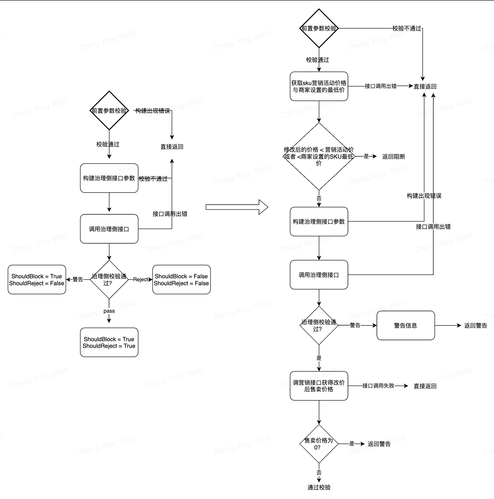

#### 代码实现

- 前置校验：用户在改价失焦之后会触发，调用校验接口，如上图所示
- 后置校验：嵌套在各项逻辑之中，函数接受interface，然后使用switch type转换为原来的参数，最后调用一个闭包函数来处理，优点在于省略了冗长的参数传递

## 系统能力升级与维护

### BugFix:增加字段支持

#### 核心需求点描述

1）ecom_tc_product_change 中type = 4 & type =15 消息中加上MarketPrice字段

2）商品变更消息中增加Status部分

#### 技术方案

营销侧主要监听的Topic是ecom_tc_product_change，消费消息类型主要为：4，5，6，7，8，9，10，11，15。product_backend不发送type=15消息。product_draft发送type=4 & 15 消息。

消息体中加内容，RMQ


### BugFix:卡券信息特殊符号兼容

- 兼容缓存中特殊字符校验

#### Bug追因&方案

老版参数过滤使用https://golang.org/pkg/net/url/#QueryUnescape，不会转义&amp; 而新使用的https://golang.org/pkg/html/#UnescapeString 会将其转义为 & 字符。因此对于存量的数据来说，在匹配时候会出错，因此解决方案为再读取存量数据的&amp；之后，使用UnescapeString 再次进行转义。

Bug修复后，修改提交后脏数据会被刷新。

#### Bug复现

productID：3488795137948184860、shopID：1111115522

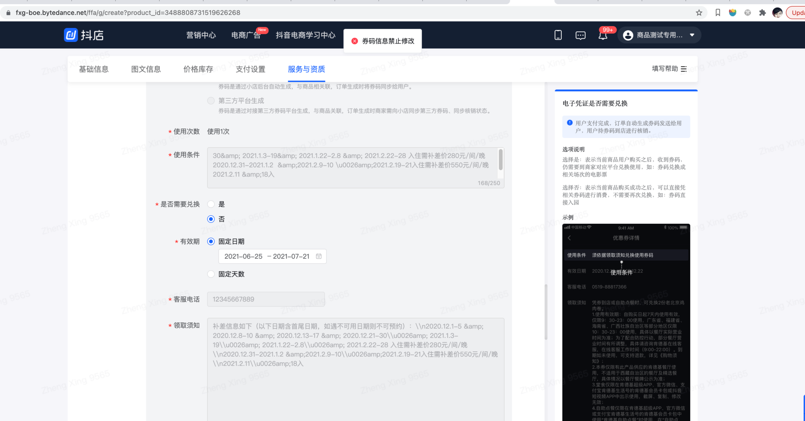


#### BUG修复

修改一行代码，使用html.UnescapeString过滤

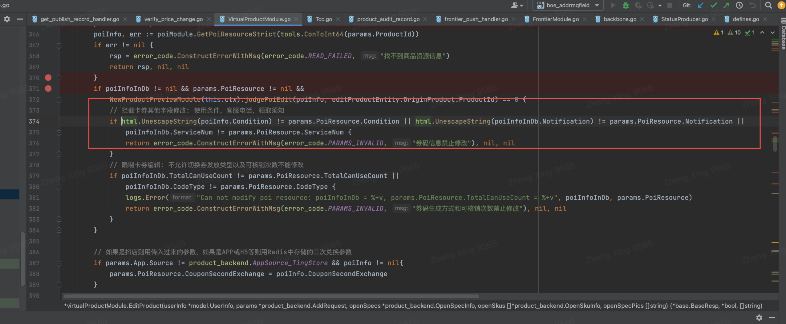

结果如下：

未做修改后提交，发布成功。脏数据被刷新

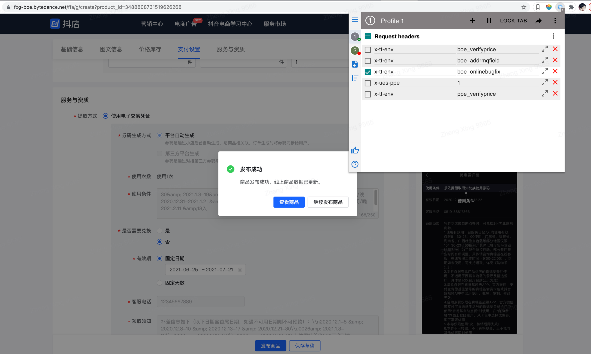

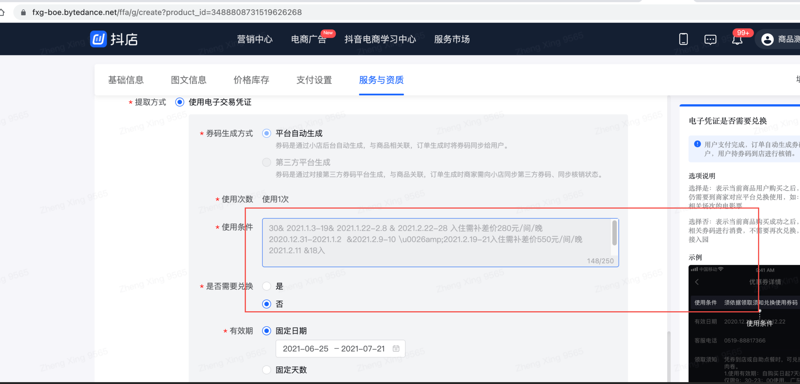

### BugFix:无发布记录时，审核中无法撤销

#### 原因追溯

- 修改商品提交，商品进入审核中流程
- 终端删除t_product_publish_record对应发布记录

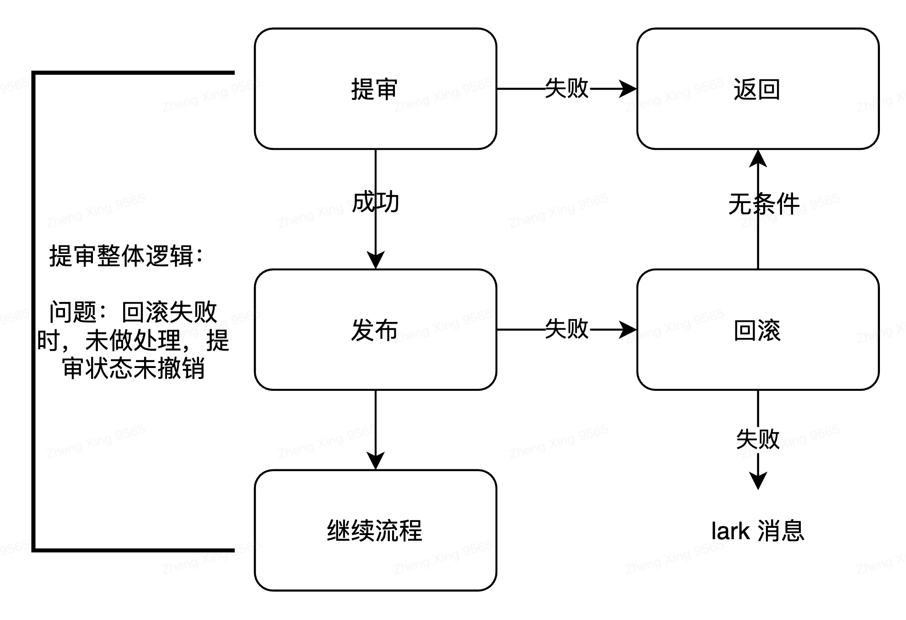

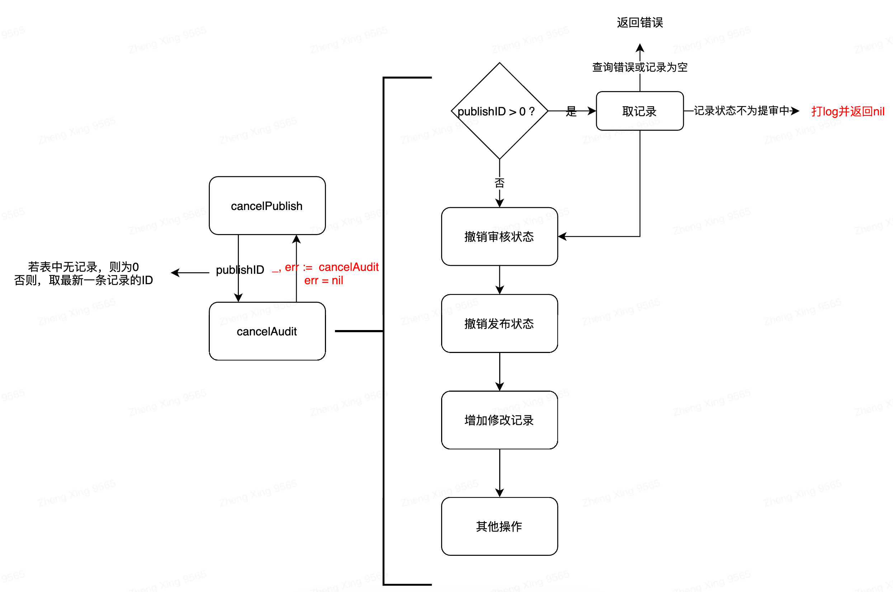

**存在两种情况：**

1. 新建商品审核中：publishID = 0**。此时并不会命中条件判断，直接进行撤销已提交状态。 问题在于前端界面无直接撤销方法，**可下架再上架，如上述图二所示。
2. 修改商品审核中：publishID != 0,  前端可调用CancelPublish方法，命中**红色字体端逻辑，前端返回撤销成功，但实际未执行撤销操作.**

#### 解决方案:

若无法保证回滚一定成功，则数据状态不一致可能存在。**解决方案**

1. **通过调整CancelAudit逻辑，增加一条判断条件，如下图所示。之前由于会读取到数据库中之前的审核记录，因此会命中记录的发布状态不等于审核中，但由于数据不一致的情况存在，因此需要加上一条，判断在线商品的草稿审核状态不等于草稿已经提交审核。**
2. **前端增加新建商品审核中 撤销审核按钮。**

### BugFix:商品字符校验调整V2

#### 放开字符限制：20 -> 30

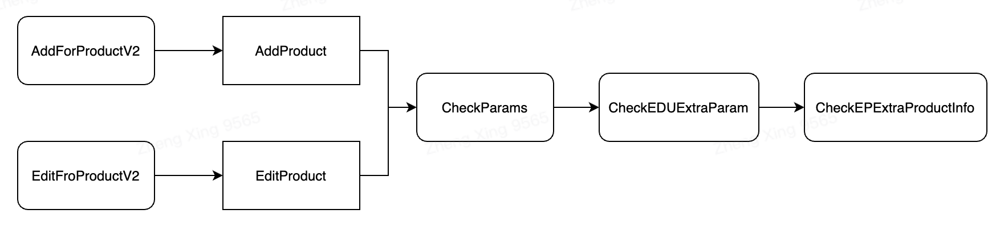

```go
// 标题
if utils.Len(lesson.Title) == 0 {
   return error_code.ConstructErrorWithMsg(error_code.PARAMS_INVALID, "课时标题不能为空")
} else if utils.Len(lesson.Title) > 30 { // fix: 增加课时限制从20 -> 30
   return error_code.ConstructErrorWithMsg(error_code.PARAMS_INVALID, "课时标题不能超过30个字符")
}
```

#### 返回值中存在空值

- 返回值为map类型。遍历map，当val 为空时，删除key

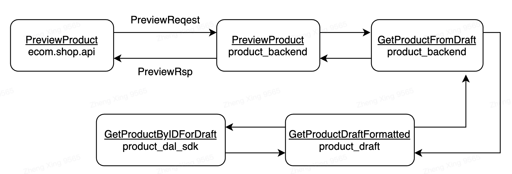

#### 创建或修改时过滤productFormat字段，不允许非法的，传入数据库

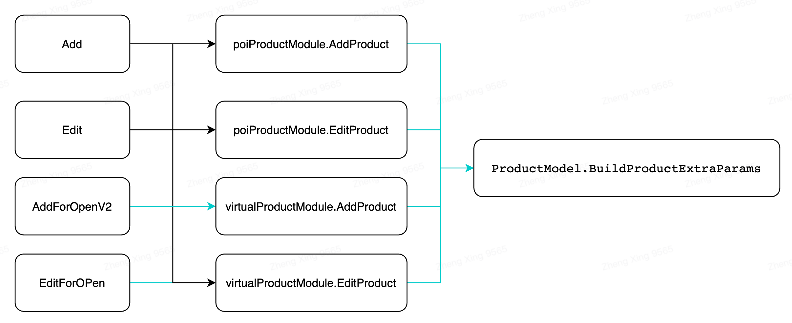

- 新增函数过滤传入值

```go
// 过滤属性值中存在的，，
func (productModel *ProductModel) FilterDot(value string) string {
   valueSlice := strings.Split(value, const_key.PropertyMultiSelectSep)
   var builder strings.Builder

   for i := 0; i < len(valueSlice); i++ {
      if strings.Compare(valueSlice[i], "") != 0 {
         if i != 0 && builder.Len() != 0 {
            builder.WriteString(const_key.PropertyMultiSelectSep)
         }
         builder.WriteString(valueSlice[i])
      }
   }

   return builder.String()
}

// 传入参数校验：防止空字段写入数据库
for _, item := range params.ProductFormat {
   if filterStr := NewProductModel(context.TODO()).FilterDot(item.FormatVal) ; strings.Compare(filterStr, "") != 0 {
      mapStr[item.FormatKey] = filterStr
   }
}
```


