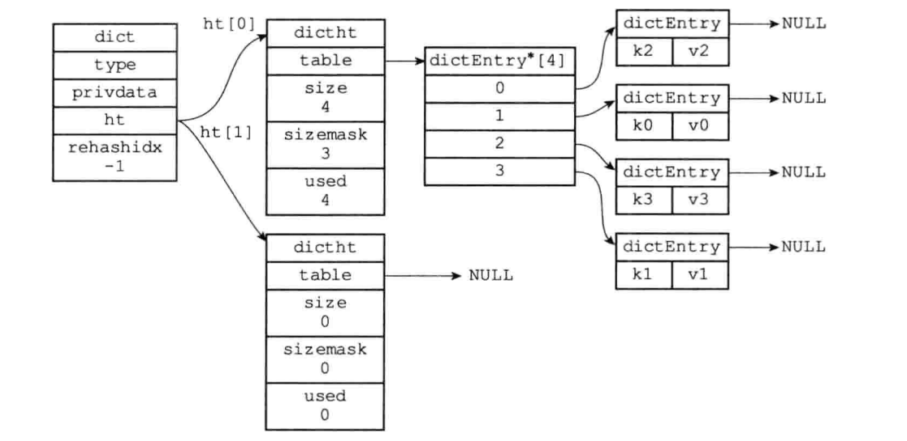

# Golang 常见面试问题

在整理golang面试题的过程中，读过很多优秀

## 基本的数据结构

### go有哪些数据结构？

基本的数据结构有:slice, Map, String.

更多的数据结构定义在了一些标准库里面，例如: sync.Map, Container/List, Container/Heap, Container/ring.

### slice实现原理, 如何进行扩容，和Redis String之间的对比

slice是在原本的数组的基础上，加了一层封装[1]。
```golang
type Slice struct {
    len, cap int
    data *Uintpoint
}
```
和Redis里面的SDS非常相似[2]。
```c
struct SDS {
    int len;
    int free;
    char buf[];
}
```
 **Slice扩容** slice 去调用append，如果任有空余，那么直接往后就行。如果没有空余，则需要进行扩容。扩容的过程，先分配一块足够大的内存。如果原来的的cap小于1024，则扩容为双倍。如果大于1024，则扩容为25%。把原来的内容拷贝过去。

 **SDS扩容** SDS 如果修改后的字符串大小小于1MB，那么分配一个同样大小的free空间。本质上等价于双倍扩容。如果大于1MB，那么free固定于1MB。

### Golang map的实现原理 与 Redis Dict比较

golang map中主要由以下数据结构组成:

```golang

type hmap struct {
	count     int
	flags     uint8
	B         uint8
	noverflow uint16
	hash0     uint32

	buckets    unsafe.Pointer
	oldbuckets unsafe.Pointer
	nevacuate  uintptr

	extra *mapextra
}

type mapextra struct {
	overflow    *[]*bmap
	oldoverflow *[]*bmap
	nextOverflow *bmap
}

type bmap struct {
    topbits  [8]uint8
    keys     [8]keytype
    values   [8]valuetype
    pad      uintptr
    overflow uintptr
}

```
可视化的标识如下。设计上，一个map实际上由多个桶构成，Buckets存储了一个桶数组。每个桶大约能存储8个数据，如果某个桶的存储的数据超过了8个，那么会使用溢出桶来存储数据。本质上是拉链法。

查找的时候，先根据hash值找到对应的桶。然后在桶中查找，比对tophash的值（TODO: 类似的思想)。插入也是一样的，首先先寻找对应的键值堆，如果找到了就进行更新。如果没找到，就插入，如果桶满了就在溢出桶中插入，如果溢出桶也满了就新建一个。


> go语言设计与实现：我们简单总结一下哈希表扩容的设计和原理，哈希在存储元素过多时会触发扩容操作，每次都会将桶的数量翻倍，扩容过程不是原子的，而是通过 runtime.growWork 增量触发的，在扩容期间访问哈希表时会使用旧桶，向哈希表写入数据时会触发旧桶元素的分流。除了这种正常的扩容之外，为了解决大量写入、删除造成的内存泄漏问题，哈希引入了 sameSizeGrow 这一机制，在出现较多溢出桶时会整理哈希的内存减少空间的占用。


**Redis** Redis中的Dict个人认为更加直观，由以下几个结构定义：

```c
typedef struct dict {
    dictType *type; // 类型特定的函数
    void *privdata; // 私有数据
    dictht ht[2]; // hash table
    int rehashidx; // rehash索引，当rehash在进行的时候，值为-1
}

typedef struct dictht {
    dictEntry **table; // 数组，存储的是哈希表的指针
    unsigned long size; // hash 表大小
    unsigned long sizemask; // hash 表大小的掩码
    unsigned long used; // 已经使用的数据量
}

typedef dictEntry {
    void *key; // 键
    ...
}
```
可视化的标识如下. redis的字典实现比较直观，由两个dictht数组构成，其中一个代表正在使用的hash表，另一个在需要扩容或者缩容的时候使用。当redis执行扩容的时候，会将原来的hash表拷贝到一个新的hash表中，然后将原来的hash表指针指向新的hash表。但是值得注意的是，3.0版本的redis是单线程的，因此如果花费大量时间在扩容上，可能造成服务短暂不可用。因此采用所谓的渐进式hash的方法进行操作，即在redis执行操作的时候，redis会顺带讲ht0上的数据迁移到ht1上。这种操作类似于



**Redis Dict和Go map 的讨论** 两者的实现都非常类似，基于拉链法，只不过golang是使用桶（数组）+ 溢出桶来构建的，而redis实现的是基于链表的。两者扩容的过程中，都是利用了另外一个相同结构的数据结构，并都不是原子的，而是渐进性的扩容。但是查找过程有些差异，go利用了tophash来加快了桶内的查找，而redis没有做类似的优化。 

### sync.Map的实现原理


## go 的内存管理

## golang 内存泄漏


## Reference
[1] [go语言设计与实现](https://draveness.me/golang/)

[2] [Redis 设计与实现](https://www.baidu.com/s?wd=redis%20%E8%AE%BE%E8%AE%A1%E4%B8%8E%E5%AE%9E%E7%8E%B0&rsv_spt=1&rsv_iqid=0xbcbe594e0002439c&issp=1&f=8&rsv_bp=1&rsv_idx=2&ie=utf-8&tn=baiduhome_pg&rsv_dl=tb&rsv_enter=1&rsv_sug3=23&rsv_sug1=6&rsv_sug7=100&rsv_sug2=0&rsv_btype=i&inputT=3051&rsv_sug4=3051)

[3] [由浅入深聊聊golang sync.Map](https://blog.csdn.net/u011957758/article/details/96633984)

