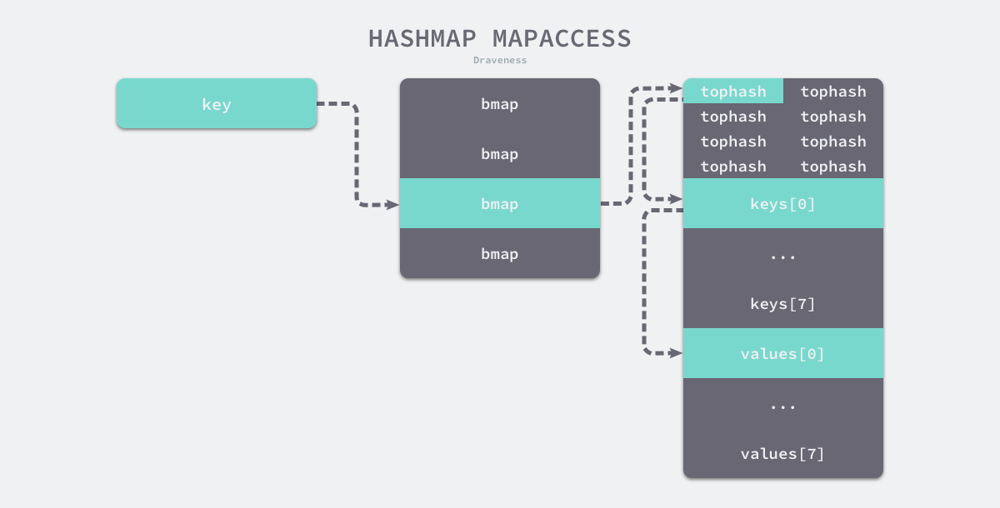
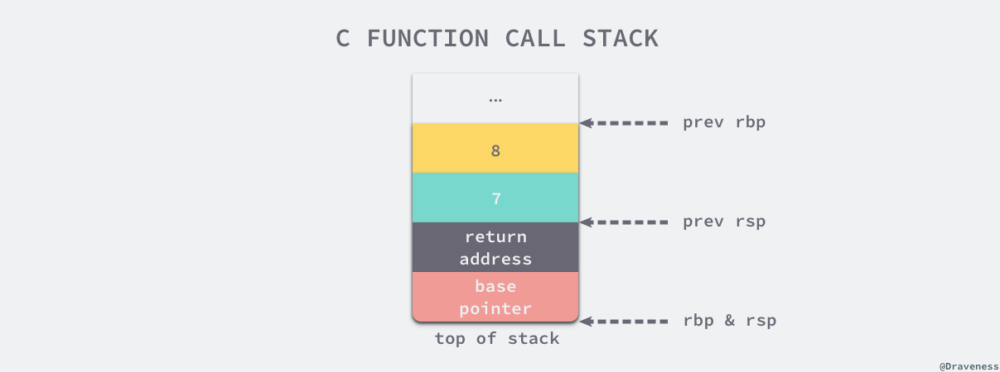

# Golang 常见面试问题

## 基本的数据结构

### go有哪些数据结构？

基本的数据结构有:slice, Map, String.

更多的数据结构定义在了一些标准库里面，例如: sync.Map, Container/List, Container/Heap, Container/ring.

### slice实现原理, 如何进行扩容，和Redis String之间的对比

slice是在原本的数组的基础上，加了一层封装[1]。
```golang
type Slice struct {
    len, cap int
    data *Uintpoint
}
```
和Redis里面的SDS非常相似[2]。
```c
struct SDS {
    int len;
    int free;
    char buf[];
}
```
 **Slice扩容** slice 去调用append，如果任有空余，那么直接往后就行。如果没有空余，则需要进行扩容。扩容的过程，先分配一块足够大的内存。如果原来的的cap小于1024，则扩容为双倍。如果大于1024，则扩容为25%。把原来的内容拷贝过去。

 **SDS扩容** SDS 如果修改后的字符串大小小于1MB，那么分配一个同样大小的free空间。本质上等价于双倍扩容。如果大于1MB，那么free固定于1MB。

**为什么不直接在已分配的内存后面加内存呢？** 
1. 和操作系统的内存管理有关，不能简单的在后面加内存。TODO：详细说说
2. 可能会占用其他重要部分的内存。

### Golang map的实现原理 与 Redis Dict比较

golang map中主要由以下数据结构组成:

```golang

type hmap struct {
	count     int
	flags     uint8
	B         uint8
	noverflow uint16
	hash0     uint32

	buckets    unsafe.Pointer
	oldbuckets unsafe.Pointer
	nevacuate  uintptr

	extra *mapextra
}

type mapextra struct {
	overflow    *[]*bmap
	oldoverflow *[]*bmap
	nextOverflow *bmap
}

type bmap struct {
    topbits  [8]uint8
    keys     [8]keytype
    values   [8]valuetype
    pad      uintptr
    overflow uintptr
}

```
可视化的标识如下。设计上，一个map实际上由多个桶构成，Buckets存储了一个桶数组。每个桶大约能存储8个数据，如果某个桶的存储的数据超过了8个，那么会使用溢出桶来存储数据。本质上是拉链法。

查找的时候，先根据hash值找到对应的桶。然后在桶中查找，比对tophash的值（TODO: 类似的思想)。插入也是一样的，首先先寻找对应的键值堆，如果找到了就进行更新。如果没找到，就插入，如果桶满了就在溢出桶中插入，如果溢出桶也满了就新建一个。


> go语言设计与实现：我们简单总结一下哈希表扩容的设计和原理，哈希在存储元素过多时会触发扩容操作，每次都会将桶的数量翻倍，扩容过程不是原子的，而是通过 runtime.growWork 增量触发的，在扩容期间访问哈希表时会使用旧桶，向哈希表写入数据时会触发旧桶元素的分流。除了这种正常的扩容之外，为了解决大量写入、删除造成的内存泄漏问题，哈希引入了 sameSizeGrow 这一机制，在出现较多溢出桶时会整理哈希的内存减少空间的占用。


**Redis** Redis中的Dict个人认为更加直观，由以下几个结构定义：

```c
typedef struct dict {
    dictType *type; // 类型特定的函数
    void *privdata; // 私有数据
    dictht ht[2]; // hash table
    int rehashidx; // rehash索引，当rehash在进行的时候，值为-1
}

typedef struct dictht {
    dictEntry **table; // 数组，存储的是哈希表的指针
    unsigned long size; // hash 表大小
    unsigned long sizemask; // hash 表大小的掩码
    unsigned long used; // 已经使用的数据量
}

typedef dictEntry {
    void *key; // 键
    union{
        void *val; // 值
        uint64_t u64; // 值
        int64_t s64; // 值
    }v;

    // 指向下一个hash表的节点，形成链表
    struct dictEntry *next;
} dictEntry;
```
可视化的标识如下. redis的字典实现比较直观，由两个dictht数组构成，其中一个代表正在使用的hash表，另一个在需要扩容或者缩容的时候使用。当redis执行扩容的时候，会将原来的hash表拷贝到一个新的hash表中，然后将原来的hash表指针指向新的hash表。但是值得注意的是，3.0版本的redis是单线程的，因此如果花费大量时间在扩容上，可能造成服务短暂不可用。因此采用所谓的渐进式hash的方法进行操作，即在redis执行操作的时候，redis会顺带讲ht0上的数据迁移到ht1上。这种操作类似于


**Redis Dict和Go map 的讨论** 两者的实现都非常类似，基于拉链法，只不过golang是使用桶（数组）+ 溢出桶来构建的，而redis实现的是基于链表的。两者扩容的过程中，都是利用了另外一个相同结构的数据结构来存储扩容之后的数据，并都不是原子操作，因此采用的是渐进式扩容，对数据进行迁移。在redis中，每次对字典进行添加、删除、查找或者更新操作时候，会顺带将原hash表上的rehashidx索引上的数据迁移到新表上，并同时操作两张表。而golang中，在写入和删除时候会出发runtime.growWork进行增量式的扩容。但是两者在查找过程有些差异，go利用了tophash来加快了桶内的查找，而redis没有做类似的优化。 

### sync.Map的实现原理[3]

原生的golang Map不支持并发写入，如果并发写的话会出发fatal。解决这个问题的方法之一是加一把大锁，用sync.Mutex 来保护防止同时写入。而
golang在v1.9 版本之后加入了官方实现的sync.Map，它是一个并发安全的Map，可以支持并发写入。
```golang
type Map struct {
	mu Mutex // 加锁作用。保护后文的dirty字段
	read atomic.Value // readOnly 存读的数据。因为是atomic.Value类型，只读，所以并发是安全的。实际存的是readOnly的数据结构。
	dirty map[interface{}]*entry //包含最新写入的数据。当misses计数达到一定值，将其赋值给read。
	misses int //计数作用。每次从read中读失败，则计数+1。
}

type readOnly struct {
    m  map[interface{}]*entry //单纯的map结构
    amended bool //Map.dirty的数据和这里的 m 中的数据不一样的时候，为true 
}

```

注意到sync.Map的实现原理，他本质是上是分离了两个s部分去操作。一个只读的map(atomic.Value: 需要硬件支持,在intel芯片上的汇编命令是cmpxchg)，一个是map - dirty，用于存储最新的数据。

**查找**的时候，先从read中查找，如果没有找到并且read和dirty不一样时，则从dirty中查找，并且将miss+1。如果都没有找到，则返回nil。如果miss达到一定值，则将dirty升级为read。

TODO: 

## 核心原理

### golang channel的实现原理？

本质上是由数组+双指针构成循环数组，加上锁和两个阻塞队列构成。runtime.hchan 结构体中的五个字段 qcount、dataqsiz、buf、sendx、recv 构建底层的循环队列：

- qcount — Channel 中的元素个数；
- dataqsiz — Channel 中的循环队列的长度；
- buf — Channel 的缓冲区数据指针；
- sendx — Channel 的发送操作处理到的位置；
- recvx — Channel 的接收操作处理到的位置；

**发送** 我们在这里可以简单梳理和总结一下使用 ch <- i 表达式向 Channel 发送数据时遇到的几种情况：
- 如果当前 Channel 的 recvq 上存在已经被阻塞的 Goroutine，那么会直接将数据发送给当前 Goroutine 并将其设置成下一个运行的 Goroutine, 直接将发送内容拷贝到目标地址上；
- 如果 Channel 存在缓冲区并且其中还有空闲的容量，我们会直接将数据存储到缓冲区 sendx 所在的位置上；
- 如果不满足上面的两种情况，会创建一个 runtime.sudog 结构并将其加入 Channel 的 sendq 队列中，当前 Goroutine 也会陷入阻塞等待其他的协程从 Channel 接收数据；

发送数据的过程中包含几个会触发 Goroutine 调度的时机：
- 发送数据时发现 Channel 上存在等待接收数据的 Goroutine，立刻设置处理器的 runnext 属性，但是并不会立刻触发调度；
- 发送数据时并没有找到接收方并且缓冲区已经满了，这时会将自己加入 Channel 的 sendq 队列并调用 runtime.goparkunlock 触发 Goroutine 的调度让出处理器的使用权；

**接收** 我们梳理一下从 Channel 中接收数据时可能会发生的五种情况：
- 如果 Channel 为空，那么会直接调用 runtime.gopark 挂起当前 Goroutine；
- 如果 Channel 已经关闭并且缓冲区没有任何数据，runtime.chanrecv 会直接返回；
- 如果 Channel 的 sendq 队列中存在挂起的 Goroutine，会将 recvx 索引所在的数据拷贝到接收变量所在的内存空间上并将 sendq 队列中 Goroutine 的数据拷贝到缓冲区；
- 如果 Channel 的缓冲区中包含数据，那么直接读取 recvx 索引对应的数据；
- 在默认情况下会挂起当前的 Goroutine，将 runtime.sudog 结构加入 recvq 队列并陷入休眠等待调度器的唤醒；

我们总结一下从 Channel 接收数据时，会触发 Goroutine 调度的两个时机：
- 当 Channel 为空时；
- 当缓冲区中不存在数据并且也不存在数据的发送者时；

**可能会panic的时机** 
- close一个已经关闭的或者为空Channel，会panic；
- 向一个已经关闭的Channel发送数据，会panic；

### golang 有哪些同步机制？实现原理？各自的适用范围？

### golang defer的原理是什么?

**关键现象** defer的调用链是一个链表式的结构，后申明的defer函数会插入到调用链的开头，因此是先进后出的原则。另一个被称为预计算参数。

defer 关键字的实现主要依靠编译器和运行时的协作，我们总结一下本节提到的三种机制：
- 堆上分配 · 1.1 ~ 1.12
    - 编译期将 defer 关键字转换成 runtime.deferproc 并在调用 defer 关键字的函数返回之前插入 runtime.deferreturn；
    - 运行时调用 runtime.deferproc 会将一个新的 runtime._defer 结构体追加到当前 Goroutine 的链表头；
    - 运行时调用 runtime.deferreturn 会从 Goroutine 的链表中取出 runtime._defer 结构并依次执行；
- 栈上分配 · 1.13
    - 当该关键字在函数体中最多执行一次时，编译期间的 cmd/compile/internal/gc.state.call 会将结构体分配到栈上并调用 runtime.deferprocStack；
- 开放编码 · 1.14 ~ 现在
    - 编译期间判断 defer 关键字、return 语句的个数确定是否开启开放编码优化；
    - 通过 deferBits 和 cmd/compile/internal/gc.openDeferInfo 存储 defer 关键字的相关信息；
    - 如果 defer 关键字的执行可以在编译期间确定，会在函数返回前直接插入相应的代码，否则会由运行时的 runtime.deferreturn 处理；


我们在本节前面提到的两个现象在这里也可以解释清楚了：
- 后调用的 defer 函数会先执行：
    - 后调用的 defer 函数会被追加到 Goroutine _defer 链表的最前面；
    - 运行 runtime._defer 时是从前到后依次执行；
- 函数的参数会被预先计算；
    - 调用 runtime.deferproc 函数创建新的延迟调用时就会立刻拷贝函数的参数，函数的参数不会等到真正执行时计算；


### golang panic 和 recover的原理是什么？

分析程序的崩溃和恢复过程比较棘手，代码不是特别容易理解。我们在本节的最后还是简单总结一下程序崩溃和恢复的过程：
- 编译器会负责做转换关键字的工作；
    - 将 panic 和 recover 分别转换成 runtime.gopanic 和 runtime.gorecover；
    - 将 defer 转换成 runtime.deferproc 函数；
    - 在调用 defer 的函数末尾调用 runtime.deferreturn 函数；
- 在运行过程中遇到 runtime.gopanic 方法时，会从 Goroutine 的链表依次取出 runtime._defer 结构体并执行；
- 如果调用延迟执行函数时遇到了 runtime.gorecover 就会将 _panic.recovered 标记成 true 并返回 panic 的参数；
    - 在这次调用结束之后，runtime.gopanic 会从 runtime._defer 结构体中取出程序计数器 pc 和栈指针 sp 并调用 runtime.recovery 函数进行恢复程序；
    - runtime.recovery 会根据传入的 pc 和 sp 跳转回 runtime.deferproc；
    - 编译器自动生成的代码会发现 runtime.deferproc 的返回值不为 0，这时会跳回 runtime.deferreturn 并恢复到正常的执行流程；
- 如果没有遇到 runtime.gorecover 就会依次遍历所有的 runtime._defer，并在最后调用 runtime.fatalpanic 中止程序、打印 panic 的参数并返回错误码 2；

分析的过程涉及了很多语言底层的知识，源代码阅读起来也比较晦涩，其中充斥着反常规的控制流程，通过程序计数器来回跳转，不过对于我们理解程序的执行流程还是很有帮助。

### golang GC的基本原理，什么时候会发生GC？

### 拓展：这种GC有什么优劣？和Java GC对比？和Python GC对比？

### golang 函数调用？
go 语言中所有的函数参数都是值传递。对于函数参数的调用惯例来说，和c语言有很大的区别。在c语言中，函数可以有多个形参，以及一个返回值，不支持多返回值。c语言中，函数形参大部分是分配在寄存器上的，多余的参数会分配在栈上。而返回值按照惯例来说是存放在eax寄存器上。而golang有很大不同，不论是函数形参还是返回值，golang都是分配在栈上，因此可以支持多返回值，并且平台相关性低。

**go 语言设计与实现 - 第二章**
 C 语言和 Go 语言在设计函数的调用惯例时选择了不同的实现。C 语言同时使用寄存器和栈传递参数，使用 eax 寄存器传递返回值；而 Go 语言使用栈传递参数和返回值。我们可以对比一下这两种设计的优点和缺点：
- C 语言的方式能够极大地减少函数调用的额外开销，但是也增加了实现的复杂度；
    - CPU 访问栈的开销比访问寄存器高几十倍；
    - 需要单独处理函数参数过多的情况；
- Go 语言的方式能够降低实现的复杂度并支持多返回值，但是牺牲了函数调用的性能；
- 不需要考虑超过寄存器数量的参数应该如何传递；
- 不需要考虑不同架构上的寄存器差异；
- 函数入参和出参的内存空间需要在栈上进行分配；

Go 语言使用栈作为参数和返回值传递的方法是综合考虑后的设计，选择这种设计意味着编译器会更加简单、更容易维护。




**go 协程的栈桢** 在runtime/stack.go中，有一段注释表明了在x86架构下的栈帧布局。也就是说在 x86架构下，golang栈帧布局从上（高地址）到下（低地址）依次为：这个函数帧的调用者传入的参数， 这个函数帧的返回地址，调用者调用时的BP快照（见上文FP用法原理），该帧本地变量，该帧调用其它函数需要传递的参数。

```golang
// Stack frame layout
//
// (x86)
// +------------------+
// | args from caller |
// +------------------+ <- frame->argp
// |  return address  |
// +------------------+
// |  caller's BP (*) | (*) if framepointer_enabled && varp < sp
// +------------------+ <- frame->varp
// |     locals       |
// +------------------+
// |  args to callee  |
// +------------------+ <- frame->sp
```

### GMP 模型? 如何实现抢占式调度？调度过程发生了什么？

### 拓展：进程，线程，协程之间的区别？go协程有什么优势？

### 拓展：操作系统是如何进行调度的？和golang有何异同？

## go 的内存管理

### 什么是内存泄漏，golang内存泄露在什么情况下会发生？什么是内存逃逸？

### golang 的内存布局是什么样的？为什么这么做，好处或者坏处？

### golang stack内存管理

**go栈帧**golang 栈帧的布局在上述说过,包含有调用者传入的参数，返回值的地址，调用方的调用时的bp快照，本地变量等等。

**linux栈空间**在linux中，一般是固定大小的栈空间，pthread_create系统会根据系统默认的线程大小或者rlimit_stack分配一个栈。

**逃逸分析**在编译器优化中，逃逸分析是用来决定指针动态作用域的方法5。Go 语言的编译器使用逃逸分析决定哪些变量应该在栈上分配，哪些变量应该在堆上分配，其中包括使用 new、make 和字面量等方法隐式分配的内存，Go 语言的逃逸分析遵循以下两个不变性：
- 指向栈对象的指针不能存在于堆中；
- 指向栈对象的指针不能在栈对象回收后存活；


golang 此前使用的是分段栈，会有热分裂的问题，即频繁的进行栈的扩容和缩容。因此在后续，golang改为了连续栈，即预先分配一部分内存作为栈，如果需要扩容，则另起一片内存，将原来栈的内容拷贝过去。在这个过程中需要注意，因为内存迁移，指针需要做相应的变换。由于编译期间，编译器做了逃逸分析，所有指向栈内存的指针都应该存在在栈中，因此，只需要遍历修改以前的栈即可。


## go框架

### HTTP框架的实现原理是什么？

### gin的实现原理是什么？为什么需要gin？

### gorm的实现原理是什么？

## Reference
[1] [go语言设计与实现](https://draveness.me/golang/)

[2] [Redis 设计与实现](https://www.baidu.com/s?wd=redis%20%E8%AE%BE%E8%AE%A1%E4%B8%8E%E5%AE%9E%E7%8E%B0&rsv_spt=1&rsv_iqid=0xbcbe594e0002439c&issp=1&f=8&rsv_bp=1&rsv_idx=2&ie=utf-8&tn=baiduhome_pg&rsv_dl=tb&rsv_enter=1&rsv_sug3=23&rsv_sug1=6&rsv_sug7=100&rsv_sug2=0&rsv_btype=i&inputT=3051&rsv_sug4=3051)

[3] [由浅入深聊聊golang sync.Map](https://blog.csdn.net/u011957758/article/details/96633984)

[4] [深入研究goroutine栈](https://studygolang.com/articles/22010)

